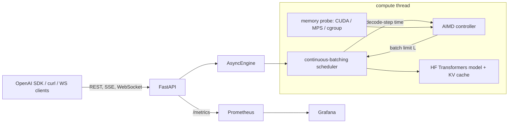

# localhost-ai

A local LLM inference server built on FastAPI and Hugging Face Transformers. It batches requests
continuously and picks the batch size at runtime with an AIMD controller. The controller grows
the batch while per-token latency stays under an SLO and device memory has headroom, and shrinks
it when either breaks. It serves an OpenAI-compatible chat API (JSON and SSE), a multiplexed
WebSocket generation API, and a WebSocket telemetry stream that shows the controller's decisions
live and lets you change the SLO or the batching mode. It exports Prometheus metrics, and runs
natively (Apple GPU via MPS, CPU, CUDA) or as a Docker Compose stack with Prometheus and a
provisioned Grafana dashboard.

The default model is SmolLM2-135M-Instruct, pinned to a Hub commit. It's small on purpose: the
project is about the serving engine, and everything here runs on a 16 GB laptop.



## Quickstart

Setup needs the network once. After that, everything runs offline.

```bash
make setup          # uv sync (locked, CPU/MPS torch) + pinned model into .models/, sha256-checked
make demo           # offline: start the server, REST + SSE + WebSocket round trip, then stop
make test           # unit tests with a fake model (no weights needed)
make test-model     # batched == sequential greedy tokens, preemption, crop, on the real model
```

Run the server natively (Apple GPU on a Mac, CUDA if present, else CPU):

```bash
uv run lhai serve --port 8000
```

Docker (CPU; containers on macOS can't reach Metal):

```bash
make up             # API on 127.0.0.1:8410, Prometheus :9410, Grafana :3410
make down
```

The compose services sit on an `internal: true` network, so the server, Prometheus and Grafana
have no route to the internet. An nginx TCP proxy is the only container with published ports.

NVIDIA (not tested here, since this machine has no NVIDIA GPU):

```bash
docker compose -p lhai -f docker-compose.yml -f docker-compose.gpu.yml up --build -d
```

## Using it

```bash
curl -N localhost:8000/v1/chat/completions -H 'content-type: application/json' -d '{
  "messages": [{"role": "user", "content": "Name three planets"}],
  "stream": true, "stream_options": {"include_usage": true}}'
```

```python
from openai import OpenAI
client = OpenAI(base_url="http://localhost:8000/v1", api_key="unused")
r = client.chat.completions.create(model="smollm2-135m", max_tokens=64,
                                   messages=[{"role": "user", "content": "Explain RAM"}])
```

```bash
uv run python scripts/ws_client.py --url ws://127.0.0.1:8000 --prompt "Explain RAM" --prompt "2+2?"
uv run python scripts/ws_top.py --url ws://127.0.0.1:8000        # live controller view
uv run python scripts/ws_top.py --url ws://127.0.0.1:8000 --set-slo 60
```

- `WS /v1/ws/generate` takes `{"type": "generate", "id", "messages", ...}` and
  `{"type": "cancel", "id"}`. It streams `accepted`, `token`, `done` (usage and timings) and
  `error` for many requests over one socket.
- `WS /v1/ws/telemetry` pushes a snapshot every interval: device, memory used/limit/headroom,
  batch limit, running and queued rows, decode-step p95, tokens/s, busy ratio and the last
  controller decision with its reason. With `?token=$LHAI_ADMIN_TOKEN` it also accepts
  `set_slo` and `set_mode` (`aimd` or `fixed` with a batch size).
- Admin routes: `/healthz`, `/readyz`, `GET/PUT /v1/admin/controller`, `/v1/admin/decisions`,
  `POST /v1/admin/models/load` (drain, unload, load, resume), `/v1/admin/egress` (runs the
  offline canary inside the server). They need `Authorization: Bearer $LHAI_ADMIN_TOKEN` when a
  token is set. With no token, they're open to anyone who can reach the port, so the server binds
  127.0.0.1 by default.
- A full queue returns 429 with `Retry-After`.

## How it works

The scheduler (`engine/scheduler.py`) batches continuously at the iteration level, in the style
of TGI v1. Each iteration admits queued requests up to the limit L, a prefill token budget and a
KV-memory budget, then prefills them together. It merges them into the running batch (left-pad,
concatenate) and runs one decode step for every row, then filters out finished rows. All
transformers cache handling is in `engine/kv.py`. On an out-of-memory error the newest row is
preempted by recompute: its KV is dropped and it is prefilled again later with the tokens it
already generated, so its output doesn't change.

The controller (`engine/controller.py`, write-up in [docs/controller.md](docs/controller.md))
runs once a second. Its update rule, in priority order:

1. OOM: halve L.
2. Headroom below 10%: L x 0.8, shedding rows.
3. Not enough fresh samples: hold.
4. p95 decode step over the SLO: L x 0.8.
5. Cooldown after an OOM: hold.
6. p95 under 90% of the SLO, with headroom above 20% and a full batch: L + 10%.
7. Otherwise hold.
8. Clamp L to what fits in memory.

"Fresh" means measured in the current epoch while the batch was within the current limit. Any
change of L starts a new epoch, so the controller never cuts twice on the same stale evidence.
The controller only sees decode-step time. Prefill stalls do show up in what a streaming client
sees, and they're bounded by `LHAI_MAX_PREFILL_TOKENS_PER_STEP`.

The controller doesn't settle on one value. In the simulator, with little noise it holds just
inside the deadband (0.875 of the capacity boundary). With noisy latency it saws between about
0.8x and 1x of a lower, noise-adjusted boundary. The range L actually covered on the real runs is in the
results below, and the trace is in the controller doc.

On a GPU, "adaptive utilization" means the batch grows until either the latency SLO or free
device memory stops it. Free memory comes from `mem_get_info` plus PyTorch's cached blocks on
CUDA, and from the Metal limit capped by what macOS can still hand out on Apple silicon. NVML
utilization is reported on NVIDIA only. On MPS and CPU the utilization signal is the engine's
busy ratio.

More detail: [docs/architecture.md](docs/architecture.md).

## Results

All numbers below are generated by `bench/report.py` from `bench/results/*.json`. Each file
embeds a run manifest: host, power, running containers, top processes, compute-lease holder and
CPU idle per point. Full tables: [bench/RESULTS.md](bench/RESULTS.md). Other agents' workloads
were running on the machine during these runs (CPU idle before each point is in the tables), so
treat absolute numbers as rough.

<!-- results:begin -->
| target | controller | clients | output tok/s | request TPOT p95 | SLO | SLO attainment | TTFT p95 |
|---|---|---:|---:|---:|---:|---:|---:|
| Apple GPU (MPS), native | fixed:1 | 64 | 10 | 23.8 ms | 71.9 ms | 100% | 147.5 s |
| Apple GPU (MPS), native | fixed:32 | 64 | 207 | 110.3 ms | 71.9 ms | 3% | 11.5 s |
| Apple GPU (MPS), native | aimd | 64 | 151 | 72.5 ms | 71.9 ms | 93% | 21.6 s |
| CPU, Docker (linux/arm64 VM; contended shared host, rough) | fixed:1 | 64 | 0 | 183.4 ms | 1883.2 ms | 100% | 284.2 s |
| CPU, Docker (linux/arm64 VM; contended shared host, rough) | fixed:32 | 64 | 6 | 713.1 ms | 1883.2 ms | 100% | 87.2 s |
| CPU, Docker (linux/arm64 VM; contended shared host, rough) | aimd | 64 | 6 | 434.5 ms | 1883.2 ms | 100% | 130.7 s |
| NVIDIA CUDA | any | | not measured | | | | |

- Apple GPU (MPS), native, 64 clients: most throughput from `fixed:32` (207 tok/s, 3% SLO attainment); `aimd` 151 tok/s at 93% attainment, L between 14 and 18 during the run.
- CPU, Docker (linux/arm64 VM; contended shared host, rough), 64 clients: most throughput from `fixed:32` (6 tok/s, 100% SLO attainment); `aimd` 6 tok/s at 100% attainment, L between 16 and 16 during the run.

Memory pressure (CPU container capped at 1500m, 32 clients, 512 tokens each):

- fixed:32: running, 41 requests completed, 0 failed.
- aimd: running, 28 requests completed, 12 failed.
<!-- results:end -->

Grafana dashboard during the Docker sweep:


## Configuration

Environment variables, prefix `LHAI_` (see `src/localhost_ai/config.py`):

- `MODEL`: preset from `models.yaml`.
- `DEVICE`: auto, cuda, mps or cpu.
- `DTYPE`.
- `QUANTIZATION`: bnb8 or bnb4, CUDA only.
- `CONTROLLER`: aimd or fixed.
- `FIXED_BATCH`, `INITIAL_BATCH` (16), `MIN_BATCH`, `MAX_BATCH` (64).
- `SLO_TPOT_MS` (100).
- `MEM_LOW_WM` (0.10), `MEM_HIGH_WM` (0.20), `MEM_RESERVE` (0.15).
- `CONTROL_INTERVAL_S` (1), `N_MIN` (20).
- `MAX_QUEUE` (256), `MAX_PREFILL_TOKENS_PER_STEP` (2048), `MAX_CONTEXT` (2048).
- `ADMIN_TOKEN`.
- `MEM_LIMIT_BYTES`: pretend-budget for native runs.

Models are pinned in `models.yaml` (repo and commit) and hashed in `models.lock`.
`lhai models pull --all` also fetches SmolLM2-360M and Qwen2.5-0.5B.

## Tests

- `make test`: about 190 tests with a deterministic fake model. They cover the controller rules
  and the S1-S6 simulator bounds over 20 seeds, the scheduler (FIFO, stop strings, cancel, 429,
  OOM preemption equivalence, merge OOM, no OOM thrash, a prefill-heavy closed loop), KV
  merge/select/crop, sampling, detokenization, probes, the OpenAI SDK against the app, SSE
  framing, WebSockets and metrics.
- `make test-model` runs on the real SmolLM2-135M on CPU fp32:
  - Five mixed-length prompts with a mid-stream join produce exactly the same 32 greedy tokens
    batched as one at a time.
  - Logits after a merge match a solo run.
  - A preempted request finishes with the same tokens.
  - A failure injected in layer 17 is cropped cleanly.
- CI runs lint and unit tests. It also runs the Docker image with `--network none` against the
  pinned weights (see `.github/workflows/ci.yml`). CI does not download models for the unit job.

## Limitations

- No paged attention. The KV cache is one padded tensor per layer, so mixed lengths waste
  memory. The KV budget and ceiling count the padding.
- One active model at a time. Hot-swap drains the queue first.
- Docker on a Mac is CPU-only (no Metal in containers).
- The CUDA path, NVML utilization, bitsandbytes quantization and `docker-compose.gpu.yml` are
  written but not tested. There is no NVIDIA GPU here, and the CUDA row in the results says
  "not measured".
- On Apple silicon the memory limit follows what other programs hold. During the MPS benchmark
  the probe saw only a few GiB, and the preflight warning is recorded in the results file.
- The controller holds decode-step latency, not end-to-end latency. TTFT grows with queueing
  when the batch is capped.
- Benchmarks ran on a shared machine; see the manifests.
- The memory-pressure run did not show what the plan hoped for. With a 1.5 GB container limit
  neither mode was OOM-killed, because the scheduler's KV admission budget applies in fixed mode
  too and kept fixed:32 to a handful of rows. AIMD did worse than fixed. Its KV ceiling
  estimates every row at the longest recent request (prompt + half of max_tokens), which is
  stricter than the per-request admission check, so L was clamped down to 1-2. Twelve AIMD
  requests then timed out in the queue. Making the ceiling use the same per-request estimate as
  admission is the obvious next fix, but it hasn't been re-measured.

## Layout

```
src/localhost_ai/   engine/ (scheduler, controller, kv, runner, sampling, detok), api/, models/,
                    memory.py, metrics.py, cli.py
bench/              loadgen.py, mempressure.py, report.py, results/, figures/, RESULTS.md
deploy/             prometheus, grafana (provisioning + dashboard generator), edge proxy
tests/              unit tests, fakes, simulator
docs/               architecture.md, controller.md, verification.md, figures/, results/
```

## Credits and license

Built on PyTorch, Hugging Face Transformers, FastAPI, prometheus-client, Prometheus and Grafana.
The continuous-batching approach follows Hugging Face TGI v1 (concatenate/filter), and recompute
preemption follows vLLM. The default model is SmolLM2-135M-Instruct by Hugging Face
(Apache-2.0). The code is MIT licensed (see `LICENSE`).
