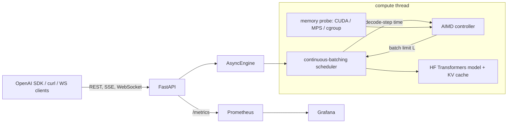

# localhost-ai

A local LLM inference server built with FastAPI and Hugging Face Transformers. It batches requests
continuously. An AIMD controller raises the batch limit while per-token latency stays under an SLO and
device memory has room, then lowers it when either constraint fails. The server has an
OpenAI-compatible chat API (JSON and SSE), a multiplexed WebSocket generation API, and a WebSocket
telemetry stream. The telemetry shows controller decisions live and lets you change the SLO or
batching mode. Prometheus metrics are available in native runs (Apple GPU via MPS, CPU, CUDA) and
in a Docker Compose stack with Prometheus and a provisioned Grafana dashboard.

The default model is SmolLM2-135M-Instruct, pinned to a Hub commit. The model is small on purpose:
the project focuses on the serving engine, and everything here runs on a 16 GB laptop.



## Quickstart

Setup needs network access once. After that, the commands below run offline.

```bash
make setup          # uv sync (locked, CPU/MPS torch) + pinned model into .models/, sha256-checked
make demo           # offline: start the server, REST + SSE + WebSocket round trip, then stop
make test           # unit tests with a fake model (no weights needed)
make test-model     # batched == sequential greedy tokens, preemption, crop, on the real model
```

Run the server natively (Apple GPU on a Mac, CUDA if present, else CPU):

```bash
uv run lhai serve --port 8000
```

Docker (CPU; containers on macOS can't reach Metal):

```bash
make up             # API on 127.0.0.1:8410, Prometheus :9410, Grafana :3410
make down
```

The compose services use an `internal: true` network. The server, Prometheus and Grafana have no
route to the internet; only the nginx TCP proxy publishes ports.

NVIDIA (not tested here, since this machine has no NVIDIA GPU):

```bash
docker compose -p lhai -f docker-compose.yml -f docker-compose.gpu.yml up --build -d
```

## Using it

```bash
curl -N localhost:8000/v1/chat/completions -H 'content-type: application/json' -d '{
  "messages": [{"role": "user", "content": "Name three planets"}],
  "stream": true, "stream_options": {"include_usage": true}}'
```

```python
from openai import OpenAI
client = OpenAI(base_url="http://localhost:8000/v1", api_key="unused")
r = client.chat.completions.create(model="smollm2-135m", max_tokens=64,
                                   messages=[{"role": "user", "content": "Explain RAM"}])
```

```bash
uv run python scripts/ws_client.py --url ws://127.0.0.1:8000 --prompt "Explain RAM" --prompt "2+2?"
uv run python scripts/ws_top.py --url ws://127.0.0.1:8000        # live controller view
uv run python scripts/ws_top.py --url ws://127.0.0.1:8000 --set-slo 60
```

- `WS /v1/ws/generate` takes `{"type": "generate", "id", "messages", ...}` and
  `{"type": "cancel", "id"}`. It streams `accepted`, `token`, `done` (usage and timings) and
  `error` for many requests over one socket.
- `WS /v1/ws/telemetry` pushes a snapshot every interval: device, memory used/limit/headroom,
  batch limit, running and queued rows, decode-step p95, tokens/s, busy ratio and the last
  controller decision with its reason. With `?token=$LHAI_ADMIN_TOKEN` it also accepts
  `set_slo` and `set_mode` (`aimd` or `fixed` with a batch size).
- Admin routes: `/healthz`, `/readyz`, `GET/PUT /v1/admin/controller`, `/v1/admin/decisions`,
  `POST /v1/admin/models/load` (drain, unload, load, resume), `/v1/admin/egress` (runs the
  offline canary inside the server). They need `Authorization: Bearer $LHAI_ADMIN_TOKEN` when a
  token is set. With no token, they're open to anyone who can reach the port, so the server binds
  127.0.0.1 by default.
- A full queue returns 429 with `Retry-After`.

Security: with no `LHAI_ADMIN_TOKEN`, the WebSocket routes only accept connections without an
`Origin` header (non-browser clients) or from a localhost origin, so a web page you visit can't
drive the server. REST routes don't send CORS headers, so browsers can't call them cross-origin
either. Set a token before binding anything other than 127.0.0.1.

## How it works

The scheduler (`engine/scheduler.py`) batches at each iteration, following TGI v1. It admits
queued requests within the limit L, the prefill token budget and the KV-memory budget, then
prefills them together. It left-pads and concatenates them with the running batch, decodes one
token for each row, and removes finished rows. `engine/kv.py` handles all Transformers cache
operations. If a step runs out of memory, the scheduler drops the newest row's KV and later
prefills that request again with its generated tokens. Recompute leaves its output unchanged.

The controller (`engine/controller.py`, write-up in [docs/controller.md](docs/controller.md))
runs once a second. Its update rule, in priority order:

1. OOM: halve L.
2. Headroom below 10%: L x 0.8, shedding rows.
3. Not enough fresh samples: hold.
4. p95 decode step over the SLO: L x 0.8.
5. Cooldown after an OOM: hold.
6. p95 under 90% of the SLO, with headroom above 20% and a full batch: L + 10%.
7. Otherwise hold.
8. Clamp L to what fits in memory.

"Fresh" samples were measured in the current epoch while the batch was within the current limit.
Every change to L starts a new epoch, so stale samples cannot trigger another cut. The controller
measures decode-step time only. Streaming clients also see prefill stalls; the
`LHAI_MAX_PREFILL_TOKENS_PER_STEP` setting bounds them.

The controller does not settle on one value. With little noise in the simulator, L holds just
inside the deadband (0.875 of the capacity boundary). With noisy latency it moves between about
0.8x and 1x of a lower, noise-adjusted boundary. The simulator met its acceptance bounds on all
20 seeds except one. With 15% noise (S3), L reached 0.469 of the boundary on that seed, below
the 0.5 floor. [docs/controller.md](docs/controller.md) records that result without tuning it
away. The results below show the range L covered in real runs.

On a GPU, "adaptive utilization" means the batch grows until either the latency SLO or free
device memory stops it. Free memory comes from `mem_get_info` plus PyTorch's cached blocks on
CUDA, and from the Metal limit capped by what macOS can still hand out on Apple silicon. NVML
utilization is reported on NVIDIA only. On MPS and CPU the utilization signal is the engine's
busy ratio.

More detail: [docs/architecture.md](docs/architecture.md).

## Results

All numbers below are generated by `bench/report.py` from `bench/results/*.json`. Each file
embeds a run manifest (chip, RAM, OS, power, coarse host load and swap) and records the CPU
idle before each point. Full tables: [bench/RESULTS.md](bench/RESULTS.md). Other workloads were
running on the machine during these runs (CPU idle before each point is in the tables), so treat
absolute numbers as rough.

<!-- results:begin -->
Apple GPU (MPS), native, 64 clients, SLO 70.5 ms per token:

| controller | output tok/s | requests completed | request TPOT p95 | SLO attainment* | TTFT p95 |
|---|---:|---:|---:|---:|---:|
| fixed:1 | 44 | 20 | 23.4 ms | 100% | 40.5 s |
| fixed:32 | 339 | 154 | 100.6 ms | 1% | 12.4 s |
| aimd | 213 | 96 | 70.4 ms | 95% | 25.5 s |

AIMD's batch limit during that run: 8 to 17.

*Share of completed requests whose per-token latency (TPOT) met the SLO. It ignores time to first token, which grows with queueing when the batch is capped; that's the TTFT column. Throughput is the server's generated-token count over the measurement window.

NVIDIA CUDA: not measured (no NVIDIA GPU here). The Docker CPU sweep ran on a contended host; its rough numbers are in RESULTS.md only.

Memory pressure after the KV-ceiling fix (CPU container capped at 1500m, 32 clients, 512 tokens each):

- fixed:32: not OOM-killed, 38 requests completed, 0 failed.
- aimd: not OOM-killed, 28 requests completed, 9 failed.
<!-- results:end -->

Grafana dashboard during the trimmed Docker CPU sweep (the batch limit steps are the sweep switching modes; AIMD held L at 16 there):


## Configuration

Environment variables, prefix `LHAI_` (see `src/localhost_ai/config.py`):

- `MODEL`: preset from `models.yaml`.
- `DEVICE`: auto, cuda, mps or cpu.
- `DTYPE`.
- `QUANTIZATION`: bnb8 or bnb4, CUDA only.
- `CONTROLLER`: aimd or fixed.
- `FIXED_BATCH`, `INITIAL_BATCH` (16), `MIN_BATCH`, `MAX_BATCH` (64).
- `SLO_TPOT_MS` (100).
- `MEM_LOW_WM` (0.10), `MEM_HIGH_WM` (0.20), `MEM_RESERVE` (0.15).
- `CONTROL_INTERVAL_S` (1), `N_MIN` (20).
- `MAX_QUEUE` (256), `MAX_PREFILL_TOKENS_PER_STEP` (2048), `MAX_CONTEXT` (2048).
- `ADMIN_TOKEN`.
- `MEM_LIMIT_BYTES`: pretend-budget for native runs.

Models are pinned in `models.yaml` (repo and commit) and hashed in `models.lock`.
`lhai models pull --all` also fetches SmolLM2-360M and Qwen2.5-0.5B.

## Tests

- `make test`: about 190 tests with a deterministic fake model. They cover the controller rules
  and the S1-S6 simulator bounds over 20 seeds, the scheduler (FIFO, stop strings, cancel, 429,
  OOM preemption equivalence, merge OOM, no OOM thrash, a prefill-heavy closed loop), KV
  merge/select/crop, sampling, detokenization, probes, the OpenAI SDK against the app, SSE
  framing, WebSockets and metrics.
- `make test-model` runs on the real SmolLM2-135M on CPU fp32:
  - Five mixed-length prompts with a mid-stream join produce exactly the same 32 greedy tokens
    batched as one at a time.
  - Logits after a merge match a solo run.
  - A preempted request finishes with the same tokens.
  - A failure injected in layer 17 is cropped cleanly.
- CI runs lint and unit tests. It also runs the Docker image with `--network none` against the
  pinned weights (see `.github/workflows/ci.yml`). CI does not download models for the unit job.

## Limitations

- No paged attention. The KV cache is one padded tensor per layer, so mixed lengths waste
  memory. The KV budget and ceiling count the padding.
- One active model at a time. Hot-swap drains the queue first.
- Docker on a Mac is CPU-only (no Metal in containers).
- The CUDA path, NVML utilization, bitsandbytes quantization and `docker-compose.gpu.yml` are
  written but not tested. There is no NVIDIA GPU here, and the CUDA row in the results says
  "not measured".
- On Apple silicon the memory limit follows what other programs hold. During the MPS benchmark
  the probe saw only a few GiB, and the preflight warning is recorded in the results file.
- The controller holds decode-step latency, not end-to-end latency. TTFT grows with queueing
  when the batch is capped.
- Benchmarks ran on a shared machine; see the manifests.
- The memory-pressure scenario does not show an AIMD advantage, before or after fixing the KV
  ceiling. With a 1.5 GB container limit neither mode was OOM-killed: the KV admission budget
  applies in fixed mode too and kept fixed:32 to 9 or fewer rows. The first run found a real bug
  (the ceiling assumed every row was as long as the longest recent request). After the fix
  (the ceiling now uses the same per-request estimate as admission, with a unit test), AIMD still
  did worse: 28 completed and 9 timed out, against 38 and 0 for fixed:32. The reason is the
  watermarks. The model and runtime alone use most of a 1.5 GB container, so headroom sits
  at 9-26%, often under the 20% needed to grow L. The early clamp to L = 1 then held, and AIMD
  admitted one request at a time while its batch drained. The KV reserve (15% of the
  limit) sits above the low watermark (10%), so the memory ceiling bites before the watermark
  rule does; tying the reserve to the watermarks is a possible change, not yet measured. At this size, fixed:32 with the
  admission budget is the better choice. Watermarks defined relative to memory above the model's
  baseline would likely help, but that's untested. The earlier claim that fixed:32 gets
  OOM-killed is dropped.

## Layout

```
src/localhost_ai/   engine/ (scheduler, controller, kv, runner, sampling, detok), api/, models/,
                    memory.py, metrics.py, cli.py
bench/              loadgen.py, mempressure.py, report.py, results/, figures/, RESULTS.md
deploy/             prometheus, grafana (provisioning + dashboard generator), edge proxy
tests/              unit tests, fakes, simulator
docs/               architecture.md, controller.md, verification.md, figures/, results/
```

## Credits and license

Built on PyTorch, Hugging Face Transformers, FastAPI, prometheus-client, Prometheus and Grafana.
The continuous-batching approach follows Hugging Face TGI v1 (concatenate/filter), and recompute
preemption follows vLLM. The default model is SmolLM2-135M-Instruct by Hugging Face
(Apache-2.0). The code is MIT licensed (see `LICENSE`).
