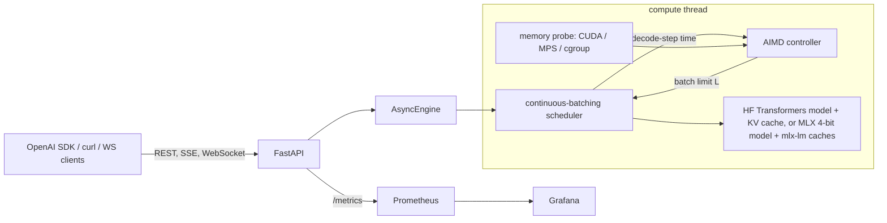
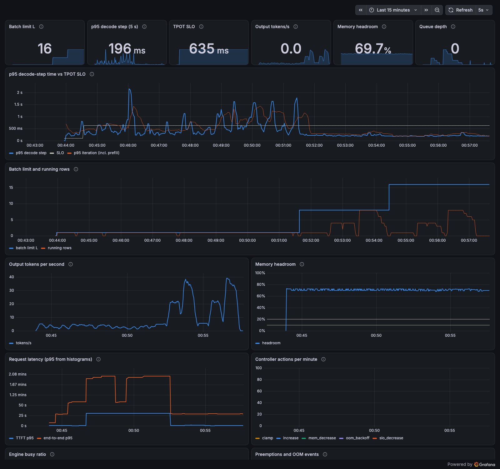

# localhost-ai

A local LLM inference server built with FastAPI and Hugging Face Transformers. It batches requests
continuously. An AIMD controller raises the batch limit while per-token latency stays under an SLO and
device memory has room, then lowers it when either constraint fails. The server has an
OpenAI-compatible chat API (JSON and SSE), a multiplexed WebSocket generation API, and a WebSocket
telemetry stream. The telemetry shows controller decisions live and lets you change the SLO or
batching mode. Prometheus metrics are available in native runs (Apple GPU via MPS, CPU, CUDA) and
in a Docker Compose stack with Prometheus and a provisioned Grafana dashboard.

The default model is SmolLM2-135M-Instruct, pinned to a Hub commit. The model is small on purpose:
the project focuses on the serving engine, and everything here runs on a 16 GB laptop.



## Quickstart

Setup needs network access once. After that, the commands below run offline.

```bash
make setup          # uv sync (locked, CPU/MPS torch) + pinned model into .models/, sha256-checked
make demo           # offline: start the server, REST + SSE + WebSocket round trip, then stop
make test           # unit tests with a fake model (no weights needed)
make test-model     # batched == sequential greedy tokens, preemption, crop, on the real model
```

Quantized models on Apple silicon go through MLX (bitsandbytes is CUDA only):

```bash
make setup-mlx      # adds the mlx extra and the 4-bit Qwen2.5-0.5B preset
make test-mlx       # batched == sequential greedy tokens on the 4-bit checkpoint
LHAI_MODEL=qwen2.5-0.5b-mlx4 uv run lhai serve --port 8000
```

The larger MLX presets, `gemma-4-e4b-mlx4` (5.2 GB download), `qwen3.5-9b-mlx4` (6.0 GB) and
`gemma-4-12b-mlx4` (6.3 GB), are fetched with `LHAI_MODEL=<preset> uv run lhai models pull`, and
`LHAI_MLX_PRESETS=qwen3.5-9b-mlx4,gemma-4-e4b-mlx4 make test-mlx` runs the same checks on them.

`gemma-4-12b-mlx4` is tight on a 16 GB Mac. Measured with `bench/mlx_direct.py`
(`bench/results/gemma-4-12b-direct.json`): 6.24 GiB active after load, 336 KiB of KV per token
(counting the 40 sliding-window layers as if they never wrap; they stop growing at 1,024
tokens, so a 2,048-token row holds about 350 MiB), and 17.3, 19.2, 19.9 and 22.3 decode tok/s
over all rows at batch 1, 2, 4 and 8. Batch 8 with short prompts peaked at 7.49 GiB. Batching
buys little on this model, so 1 to 2 concurrent requests is the useful range, and 4 rows of
2,048 tokens is about as far as the memory goes next to other programs. The checkpoint's
`model_type` is `gemma4_unified`, which the pinned mlx-lm 0.31.3 doesn't list; the loader maps
it to mlx-lm's `gemma4` class and drops the checkpoint's `vision_embedder` weights, with strict
loading for everything else.

Run the server natively (Apple GPU on a Mac, CUDA if present, else CPU):

```bash
uv run lhai serve --port 8000
```

Docker (CPU; containers on macOS can't reach Metal):

```bash
make up             # API on 127.0.0.1:8410, Prometheus :9410, Grafana :3410
make down
```

The compose services use an `internal: true` network. The server, Prometheus and Grafana have no
route to the internet; only the nginx TCP proxy publishes ports.

NVIDIA (not tested here, since this machine has no NVIDIA GPU):

```bash
docker compose -p lhai -f docker-compose.yml -f docker-compose.gpu.yml up --build -d
```

## Using it

```bash
curl -N localhost:8000/v1/chat/completions -H 'content-type: application/json' -d '{
  "messages": [{"role": "user", "content": "Name three planets"}],
  "stream": true, "stream_options": {"include_usage": true}}'
```

```python
from openai import OpenAI
client = OpenAI(base_url="http://localhost:8000/v1", api_key="unused")
r = client.chat.completions.create(model="smollm2-135m", max_tokens=64,
                                   messages=[{"role": "user", "content": "Explain RAM"}])
```

```bash
uv run python scripts/ws_client.py --url ws://127.0.0.1:8000 --prompt "Explain RAM" --prompt "2+2?"
uv run python scripts/ws_top.py --url ws://127.0.0.1:8000        # live controller view
uv run python scripts/ws_top.py --url ws://127.0.0.1:8000 --set-slo 60
```

- `WS /v1/ws/generate` takes `{"type": "generate", "id", "messages", ...}` and
  `{"type": "cancel", "id"}`. It streams `accepted`, `token`, `done` (usage and timings) and
  `error` for many requests over one socket.
- `WS /v1/ws/telemetry` pushes a snapshot every interval: device, memory used/limit/headroom,
  batch limit, running and queued rows, decode-step p95, tokens/s, busy ratio and the last
  controller decision with its reason. With `?token=$LHAI_ADMIN_TOKEN` it also accepts
  `set_slo` and `set_mode` (`aimd` or `fixed` with a batch size).
- Admin routes: `/healthz`, `/readyz`, `GET/PUT /v1/admin/controller`, `/v1/admin/decisions`,
  `POST /v1/admin/models/load` (drain, unload, load, resume), `/v1/admin/egress` (runs the
  offline canary inside the server). They need `Authorization: Bearer $LHAI_ADMIN_TOKEN` when a
  token is set. With no token, they're open to anyone who can reach the port, so the server binds
  127.0.0.1 by default.
- A full queue returns 429 with `Retry-After`.

Security:
- The server only answers requests whose `Host` header is in `LHAI_ALLOWED_HOSTS` (localhost
  names and the compose service name by default). This blocks DNS-rebinding pages.
- WebSocket handshakes from a browser must come from a page this server served (same host
  and port), or from an origin listed in `LHAI_ALLOWED_ORIGINS`, with or without a token. A
  page on another localhost port counts as another origin. Non-browser clients send no
  `Origin` header and are allowed.
- REST routes send no CORS headers, so other sites can't call them from a browser.
- The admin token guards admin routes and the telemetry controls. Generation is open to anyone
  who can reach the port.
- Set a token, and extend the host list deliberately, before binding anything other than
  127.0.0.1.

### JSON output

`response_format` works as in the OpenAI API: `{"type": "json_object"}` for any JSON object,
or `{"type": "json_schema", "json_schema": {"name": ..., "schema": {...}, "strict": true}}`.
The grammar is enforced token by token with [llguidance](https://github.com/guidance-ai/llguidance):
before each token is sampled, every token that can't continue valid JSON (or that breaks the
schema) is masked out, so a response that finishes with `finish_reason: "stop"` always parses.
It works on both backends and in batches that mix constrained and plain requests, and it also
works on the WebSocket API.

```python
r = client.chat.completions.create(
    model="qwen2.5-3b-mlx4", messages=[{"role": "user", "content": "Paris as JSON"}],
    response_format={"type": "json_schema", "json_schema": {"name": "city", "strict": True,
        "schema": {"type": "object", "required": ["city", "population"],
                   "properties": {"city": {"type": "string"},
                                  "population": {"type": "integer", "maximum": 10**9}}}}})
json.loads(r.choices[0].message.content)
```

Things to know:
- `stop` strings can't be combined with a JSON `response_format` (the request gets a 400),
  since a stop string could end the JSON early with `finish_reason: "stop"`.
- A response cut off by `max_tokens` (`finish_reason: "length"`) is a valid JSON prefix, not a
  complete document. Small models can repeat digits or string characters until the limit, so
  bounds in the schema (`maximum`, `maxLength`, `maxItems`) help.
- Stop sequences still apply and can end the output early.
- The first constrained request on a model builds llguidance's view of the vocabulary (about
  a second for a 150k vocabulary). The cost per token is in [bench/RESULTS.md](bench/RESULTS.md).
- A schema llguidance can't compile gets a 400. With `strict: true`, unsupported keywords are
  errors; without it they are ignored.

### LoRA adapters

On MLX presets, one base model can serve several LoRA adapters at once. Each request picks one
by sending its name as `model` (or in an `adapter` field), and a batch can mix rows on
different adapters with rows on the base model in the same forward pass. Adapters are mlx-lm
LoRA checkpoints (a directory with `adapter_config.json` and `adapters.safetensors`, or one
checkpoint file inside such a directory):

```bash
LHAI_MODEL=llama-3.2-3b-mlx4 \
LHAI_ADAPTERS="eduai=../eduai/adapters/llama32-3b-eduai,eduai-300=../eduai/adapters/llama32-3b-eduai/0000300_adapters.safetensors" \
  uv run lhai serve
curl localhost:8000/v1/models        # llama-3.2-3b-mlx4, plus eduai and eduai-300 with parent set
```

```python
client.chat.completions.create(model="eduai", messages=[...])              # the adapter
client.chat.completions.create(model="llama-3.2-3b-mlx4", messages=[...])  # the base model
```

The adapters above are the ones EduAI trains for Llama-3.2-3B-Instruct 4-bit: the final
checkpoint and the one from halfway through the same run. Requests without an adapter run the
base layers only and give the same tokens as a server with no adapters loaded.

### Thinking models

Qwen3.5 and Gemma 4 can write a reasoning block before they answer. The presets keep thinking
off. A request can turn it on with `chat_template_kwargs` (as in vLLM), which is merged over the
preset's own template variables, and can cap the block with `max_thinking_tokens`:

```python
r = client.chat.completions.create(
    model="qwen3.5-9b-mlx4", messages=[{"role": "user", "content": "Is 391 prime?"}],
    max_tokens=512,
    extra_body={"chat_template_kwargs": {"enable_thinking": True}, "max_thinking_tokens": 256})
r.choices[0].message.reasoning_content   # the thinking block
r.choices[0].message.content             # the answer
r.usage.thinking_tokens                  # also in usage.completion_tokens_details
```

When the block reaches the budget, the server makes the next tokens a newline and the model's
closing marker (`</think>` for Qwen3.5, `<channel|>` for Gemma 4's thought channel), and the
model then writes its answer as usual. The reasoning goes back in `reasoning_content`, in
streaming deltas too, and the markers appear in neither field. `max_tokens` still counts every
generated token, thinking included. A JSON `response_format` constrains only the answer: the
mask starts after the block closes, and the row can't end inside the block. Stop strings apply to the answer only. Asking for
`max_thinking_tokens` on a model without thinking markers is a 400.

### Scoring (`POST /v1/score`)

`/v1/score` teacher-forces a fixed assistant answer and returns the log-probability of
candidate strings at given character offsets of it, with no sampling. Vizor uses it to measure
how likely the model is to cite each source at a citation site.

```bash
curl localhost:8000/v1/score -H 'content-type: application/json' -d '{
  "messages": [{"role": "user", "content": "Sources: [1] ... [2] ... Where is the tower?"}],
  "continuation": "It is in Paris [1].",
  "sites": [{"char_offset": 16, "candidates": ["1", "2"]}]}'
```

The chat template is applied with the generation prompt, the continuation is appended as text
with no end-of-turn token, and prompt plus continuation are tokenized together. Each
`char_offset` is mapped to a token through the tokenizer's offsets. At a token start, a
single-token candidate is read from one forward pass over the whole sequence. Inside a token,
or for a multi-token candidate, the server backs off to the token's start and teacher-forces
the text from there to the site, then the candidate. The response has, per site in request
order, `token_index`, `candidates` (log-probabilities), `renorm` (the same renormalized over the
candidates) and `forced`. It also reports `model`, `revision`, `commit` (plus `dirty`),
`tokenizer_sha` (sha256 over the checkpoint's tokenizer files) and `prompt_tokens`. A sequence
longer than `LHAI_MAX_CONTEXT` is a 400 with code `context_length_exceeded`; nothing is
truncated. The forward passes run on the compute thread between scheduler iterations, so
scoring can share a server with generation traffic. Scores are always for the base model, even
when LoRA adapters are loaded.

## How it works

The scheduler (`engine/scheduler.py`) batches at each iteration, following TGI v1. It admits
queued requests within the limit L, the prefill token budget and the KV-memory budget, then
prefills them together. It left-pads and concatenates them with the running batch, decodes one
token for each row, and removes finished rows. `engine/kv.py` handles all Transformers cache
operations. If a step runs out of memory, the scheduler drops the newest row's KV and later
prefills that request again with its generated tokens. Recompute leaves its output unchanged.

The controller (`engine/controller.py`, write-up in [docs/controller.md](docs/controller.md))
runs once a second. Its update rule, in priority order:

1. OOM: halve L.
2. Headroom below 10%: L x 0.8, shedding rows.
3. Not enough fresh samples: hold.
4. p95 decode step over the SLO: L x 0.8.
5. Cooldown after an OOM: hold.
6. p95 under 90% of the SLO, with headroom above 20% and a full batch: L + 10%.
7. Otherwise hold.
8. Clamp growth to what fits in memory. If the estimate drops below the rows already running, L
   stays put and admission's own KV check blocks new joins.

"Fresh" samples were measured in the current epoch while the batch was within the current limit.
Every change to L starts a new epoch, so stale samples cannot trigger another cut. The controller
measures decode-step time only. Streaming clients also see prefill stalls; the
`LHAI_MAX_PREFILL_TOKENS_PER_STEP` setting bounds them.

The controller does not settle on one value. With little noise in the simulator, L holds just
inside the deadband (0.875 of the capacity boundary). With noisy latency it moves between about
0.8x and 1x of a lower, noise-adjusted boundary. The simulator met its acceptance bounds on all
20 seeds except one. With 15% noise (S3), L reached 0.469 of the boundary on that seed, below
the 0.5 floor. [docs/controller.md](docs/controller.md) records that result without tuning it
away. The results below show the range L covered in real runs.

On a GPU, "adaptive utilization" means the batch grows until either the latency SLO or free
device memory stops it. Free memory comes from `mem_get_info` plus PyTorch's cached blocks on
CUDA, and from the Metal limit capped by what macOS can still hand out on Apple silicon. NVML
utilization is reported on NVIDIA only. On MPS and CPU the utilization signal is the engine's
busy ratio.

With `LHAI_PREFIX_CACHE=1` the server also caches shared prompt prefixes (`engine/prefix.py`).
When two recent prompts start with the same 32 or more tokens, typically a system prompt, that
prefix is computed once and stored. Later rows start from a copy of its cache and prefill only
the rest of their prompt. Stored prefixes count as used memory, stay under a size cap, and are
the first thing dropped under memory pressure. Both the torch and the MLX runner support it.

More detail: [docs/architecture.md](docs/architecture.md).

## Results

All numbers below are generated by `bench/report.py` from `bench/results/*.json`. Each file
embeds a small manifest (OS, Python, torch and transformers versions, 1-minute load) plus
the memory probe and swap reading taken before the run, and the CPU idle before each point.
Full tables: [bench/RESULTS.md](bench/RESULTS.md). Other workloads were running on the machine
during these runs (CPU idle before each point is in the tables), so treat absolute numbers as
rough.

<!-- results:begin -->
Apple GPU (MPS), native, 64 clients, SLO 70.5 ms per token:

| controller | output tok/s | requests completed | request TPOT p95 | SLO attainment* | TTFT p95 |
|---|---:|---:|---:|---:|---:|
| fixed:1 | 44 | 20 | 23.4 ms | 100% | 40.5 s |
| fixed:32 | 339 | 154 | 100.6 ms | 1% | 12.4 s |
| aimd | 213 | 96 | 70.4 ms | 95% | 25.5 s |

AIMD's batch limit during that run: 8 to 17.

*Share of completed requests whose per-token latency (TPOT) met the SLO. It ignores time to first token, which grows with queueing when the batch is capped; that's the TTFT column. Throughput is the server's generated-token count over the measurement window.

MLX 4-bit presets on the same Mac (runner-only decode, 128 greedy steps; served numbers from each preset's sweep in RESULTS.md):

| preset | memory after load | decode tok/s, 1 row | decode tok/s, 16 rows | served AIMD peak |
|---|---:|---:|---:|---|
| qwen2.5-0.5b-mlx4 | 0.26 GiB | 158 | 881 | 153 tok/s at 32 clients, 42% within the 34.8 ms SLO |
| gemma-4-e4b-mlx4 | 3.91 GiB | 38 | 104 | 44 tok/s at 16 clients, 11% within the 98.7 ms SLO |
| qwen3.5-9b-mlx4 | 4.69 GiB | 26 | 64 | 23 tok/s at 4 clients, 36% within the 123.5 ms SLO |

NVIDIA CUDA: not measured (no NVIDIA GPU here). The Docker CPU sweep ran on a contended host; its rough numbers are in RESULTS.md only.

Memory pressure, same-session pair on the current code (CPU container capped at 1500m, 32 clients, 512 tokens each, 60 s):

- fixed:32: not OOM-killed, 32 tok/s, 7 requests finished inside the window, 0 failed.
- aimd: not OOM-killed, 37 tok/s, 5 requests finished inside the window, 0 failed.

Earlier pressure runs (before the guard, and an AIMD-only run) are in RESULTS.md; they come from different host windows and aren't compared here.
<!-- results:end -->

<!-- comparison:begin -->
Against other local servers on the same Mac, Qwen2.5-3B-Instruct 4-bit (MLX 4-bit for the MLX engines, Q4_K_M GGUF for llama.cpp and Ollama), same client and prompts:

| engine | tok/s, 1 client | TPOT p50, 1 client | tok/s, 16 clients | TPOT p50, 16 clients | TTFT p50, 16 clients | peak footprint |
|---|---:|---:|---:|---:|---:|---:|
| localhost-ai (AIMD) | 54 | 16.4 ms | 140 | 97.2 ms | 1288 ms | 8.49 GiB |
| localhost-ai (fixed:32) | 54 | 16.3 ms | 157 | 101.3 ms | 803 ms | 8.29 GiB |
| mlx_lm.server | 51 | 16.1 ms | 119 | 122.2 ms | 1639 ms | 4.84 GiB |
| llama.cpp llama-server | 52 | 17.8 ms | 144 | 112.9 ms | 592 ms | 2.61 GiB |
| Ollama | 51 | 17.8 ms | 148 | 111.6 ms | 559 ms | 2.62 GiB |

The quantizations differ and the other servers cache repeated prompt prefixes by default; the full table and caveats are in RESULTS.md.

`response_format` costs 0.22-0.48 ms of CPU per constrained row per token on `qwen2.5-3b-mlx4` (RESULTS.md has step times with and without it).
<!-- comparison:end -->

Grafana dashboard during the trimmed Docker CPU sweep (the batch limit steps are the sweep switching modes; AIMD held L at 16 there):



## Configuration

Environment variables, prefix `LHAI_` (see `src/localhost_ai/config.py`):

- `MODEL`: preset from `models.yaml`.
- `DEVICE`: auto, cuda, mps or cpu.
- `DTYPE`.
- `QUANTIZATION`: bnb8 or bnb4, CUDA only. On Apple silicon, pick an MLX preset instead.
- `CONTROLLER`: aimd or fixed.
- `FIXED_BATCH`, `INITIAL_BATCH` (16), `MIN_BATCH`, `MAX_BATCH` (64).
- `SLO_TPOT_MS` (100).
- `MEM_LOW_WM` (0.10), `MEM_HIGH_WM` (0.20), `MEM_RESERVE` (0.15).
- `CONTROL_INTERVAL_S` (1), `N_MIN` (20).
- `MAX_QUEUE` (256), `MAX_PREFILL_TOKENS_PER_STEP` (2048), `MAX_CONTEXT` (2048).
- `PREFIX_CACHE` (off), `PREFIX_CACHE_MB` (512), `PREFIX_MIN_TOKENS` (32): reuse the prefill
  of a prompt prefix that recent requests share, such as a long system prompt.
- `ADMIN_TOKEN`, `ALLOWED_HOSTS`, `ALLOWED_ORIGINS`.
- `MEM_LIMIT_BYTES`: pretend-budget for native runs.
- `ADAPTERS`: LoRA adapters for the startup model (MLX presets), `name=path,name2=path2`.

Models are pinned in `models.yaml` (repo and commit) and hashed in `models.lock`.
`lhai models pull --all` also fetches SmolLM2-360M, Qwen2.5-0.5B and the three MLX presets
(about 13 GB with the default model).

A preset with `backend: mlx` names a pre-quantized MLX checkpoint (`quantization: mlx4` or
`mlx8`, checked against the checkpoint's `config.json` on load) and runs through
`engine/mlx_runner.py` with the same scheduler and controller. Its memory probe reads MLX's
allocator instead of torch.mps. `chat_template_kwargs` in a preset is passed to the chat
template (the Qwen3.5 preset turns thinking off with it). See
[docs/architecture.md](docs/architecture.md#mlx-backend-enginemlx_runnerpy) for how the batch
caches work and what differs from the torch path.

## Tests

- `make test`: 403 tests, most with a deterministic fake model. 67 of them need the mlx extra
  and skip on machines that aren't Apple silicon. They cover the
  controller rules and the S1-S6 simulator bounds over 20 seeds, the scheduler (FIFO, stop
  strings, cancel, 429, OOM preemption equivalence, merge OOM, no OOM thrash, a prefill-heavy
  closed loop), KV merge/select/crop, sampling, detokenization, probes, the OpenAI SDK against
  the app, SSE framing, WebSockets and metrics. On Apple silicon with the mlx extra it also runs the MLX
  runner against tiny random-weight Llama, Qwen3.5 and Gemma 4 models built in-process. Batched
  logits are compared against the model's own single-sequence caches, through joins, row
  selection, chunked prefill and the lost-cache path. For the hybrid Qwen3.5 it checks that pad
  tokens stay out of the recurrent state; for Gemma 4 it runs past a 4-token sliding window with
  KV-sharing layers. The scheduler is also run on those models: seeded sampling alone and in a
  batch, an injected allocation failure that forces a whole-batch recompute, and a cancel. The
  CI workflow has a macOS job for these on MLX's CPU backend (`LHAI_MLX_DEVICE=cpu`); they pass
  that way locally, but the job hasn't run on GitHub yet.
- `make test-mlx` runs the batched-vs-sequential greedy check through the scheduler on the real
  4-bit checkpoints, plus the same check with the prefix cache on and a shared system prompt,
  `/v1/score` against a direct mlx-lm forward that follows Vizor's MLXScorer (to 1e-4, with a
  site inside a token), and `max_thinking_tokens` on the thinking models (the budget closes the
  block with the model's own marker; a JSON answer after it parses). On
  `qwen2.5-0.5b-mlx4,qwen3.5-9b-mlx4,gemma-4-e4b-mlx4`: 28 passed, 3 skipped (the thinking
  tests, on Qwen2.5, which has no thinking markers). On `gemma-4-12b-mlx4`: 12 passed and the
  batched greedy check is an expected failure: one prompt of five drifts at token 22, which
  fits the seed check in bench/RESULTS.md.
- `make test-model` runs on the real SmolLM2-135M on CPU fp32:
  - Five mixed-length prompts with a mid-stream join produce exactly the same 32 greedy tokens
    batched as one at a time.
  - Logits after a merge match a solo run.
  - A preempted request finishes with the same tokens.
  - A failure injected in layer 17 is cropped cleanly.
  - With a shared system prompt and the prefix cache on, the batched greedy tokens match the
    uncached one-at-a-time run.
- `make test` also covers `response_format` (a fake model with a small JSON vocabulary: every
  output that stops parses and matches its schema, including after preemption) and multi-LoRA
  on a tiny random Llama (each adapter row matches mlx-lm's own LoRA layer, mixed batches match
  each row alone, base rows are bit-identical to a model without adapters).
- On the real models (`make test-model`, `make test-mlx`): batched JSON-schema generation on
  SmolLM2-135M and Qwen2.5-0.5B, and EduAI's two Llama-3.2-3B adapters in one mixed batch with
  base rows, each row compared token for token with mlx-lm's `stream_generate` with that
  adapter loaded (`tests/test_lora_model.py`; set `LHAI_EDUAI_ADAPTER` if the adapters aren't
  in `../eduai/adapters/llama32-3b-eduai`).
- CI runs lint and unit tests. It also runs the Docker image with `--network none` against the
  pinned weights (see `.github/workflows/ci.yml`). CI does not download models for the unit job.

## Limitations

- No paged attention. The KV cache is one padded tensor per layer, so mixed lengths waste
  memory. The KV budget and ceiling count the padding. docs/architecture.md has the design
  and why it isn't built on top of mlx-lm's cache classes.
- Batched rows are not bit-identical to solo rows on the 4-bit MLX weights. On Qwen3.5-9B,
  seeded and greedy requests repeat exactly when run one at a time, but from two rows up some
  rows diverge within 64 tokens (bench/RESULTS.md, seed check). Send requests one at a time
  where byte-identical output matters.
- `/v1/score` scores the base model only, runs one cache-free forward per request (plus one
  per teacher-forced candidate), and doesn't reuse stored prefixes.
- `max_thinking_tokens` counts toward `max_tokens` and the context. A 3,000-token budget
  needs `LHAI_MAX_CONTEXT` above the default 2,048.
- mlx-lm's own tokenizer wrapper turns `enable_thinking` on by default for Qwen3.5 and Gemma 4;
  this server keeps the preset's setting (off) unless the request says otherwise.
- Prefix caching saves prefill, not memory: each row still holds its own copy of the prefix
  KV. It is off by default because a row built on a stored prefix isn't guaranteed bit-identical
  logits on low-precision backends.
- One active model at a time. Hot-swap drains the queue first.
- Quantized models on a Mac need the MLX backend and a pre-quantized mlx-community checkpoint.
  Nothing is quantized on load there, and MLX presets are text only (the Qwen3.5 vision tower
  and the Gemma 4 vision and audio towers are dropped). mlx-lm is pinned exactly because the
  runner uses its cache classes.
- On MLX a failed forward pass can't be cropped back, so one OOM re-prefills every running row
  instead of just the newest one, and the batch is rebuilt one row smaller. Running out of
  unified memory usually shows up as swapping before MLX raises anything, so the probe
  watermarks and the KV ceiling are what keep it in bounds.
- MLX memory per row is priced from the cache layout (full vs sliding-window layers, 256-token
  allocation steps, recurrent state), and the KV in use is read off the cache arrays. After
  rows leave, the trimmed arrays are views of the old buffers, so the figure can be a little low
  until the next reallocation.
- LoRA adapters are fixed at startup (`LHAI_ADAPTERS`) and apply to MLX presets only. There's
  no endpoint to add one at runtime, and a hot-swapped model loads without them. Rows on an
  adapter skip the prefix cache, which holds base-model KV.
- Constrained decoding computes each row's token mask on the CPU, one row at a time, in the
  compute thread.
- Docker on a Mac is CPU-only (no Metal in containers).
- The CUDA path, NVML utilization, bitsandbytes quantization and `docker-compose.gpu.yml` are
  written but not tested. There is no NVIDIA GPU here, and the CUDA row in the results says
  "not measured".
- On Apple silicon the memory limit follows what other programs hold. During the MPS benchmark
  the probe saw only a few GiB, and the preflight warning is recorded in the results file.
- The controller holds decode-step latency, not end-to-end latency. TTFT grows with queueing
  when the batch is capped.
- Benchmarks ran on a shared machine; see the manifests.
- The memory-pressure scenario (1.5 GB container, 32 clients, 512-token requests) doesn't show a
  clear AIMD advantage, and neither mode was ever OOM-killed. The KV admission budget applies
  in fixed mode too, which keeps fixed:32 to about 10 rows. The earlier claim that fixed:32 gets
  OOM-killed is dropped. The history:
  - The first runs found two real problems: the KV ceiling assumed every row was as long as the
    longest recent request, and a low ceiling estimate ratcheted L down while admitted rows
    drained. With those, AIMD fell to L = 1 and requests timed out.
  - Both are fixed, with tests.
  - In the latest same-session pair, AIMD produced 37 tok/s against 32 for fixed:32, with no
    errors among the requests that finished inside the 60 s window. Both runs drained in under
    434 s, below the 600 s request timeout behind the earlier failures.
  - That is one run each, and only a handful of requests finished inside the window, so it's no
    evidence that AIMD is better, only no sign of the earlier failures.
  - The KV reserve (15%) still sits above the low watermark (10%). Tying them together, or
    measuring headroom above the model's baseline, is untested.

## Layout

```
src/localhost_ai/   engine/ (scheduler, controller, kv, runner, sampling, constrain, lora, detok),
                    api/, models/, memory.py, metrics.py, cli.py
bench/              loadgen.py, baseline.py, mempressure.py, report.py, results/, figures/,
                    RESULTS.md
deploy/             prometheus, grafana (provisioning + dashboard generator), edge proxy
tests/              unit tests, fakes, simulator
docs/               architecture.md, controller.md, verification.md, figures/, results/
```

## Credits and license

Built on PyTorch, Hugging Face Transformers, MLX and mlx-lm, llguidance, FastAPI,
prometheus-client, Prometheus and Grafana. The continuous-batching approach follows Hugging
Face TGI v1 (concatenate/filter), and recompute preemption follows vLLM. The default model is
SmolLM2-135M-Instruct by Hugging Face (Apache-2.0). The optional MLX presets are mlx-community
conversions of Qwen2.5 and Qwen3.5 (Apache-2.0) and Gemma 4 (Gemma terms of use); they are
downloaded, not redistributed here. The code is MIT licensed (see `LICENSE`).
