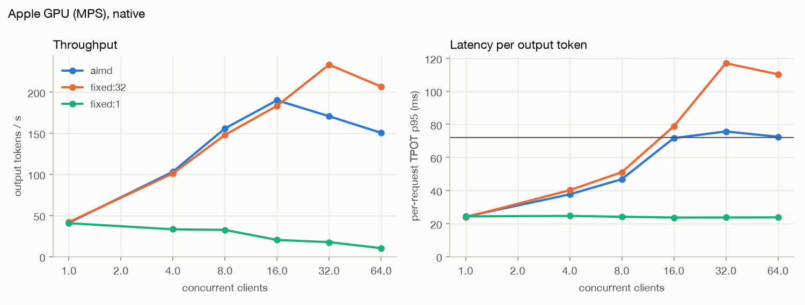
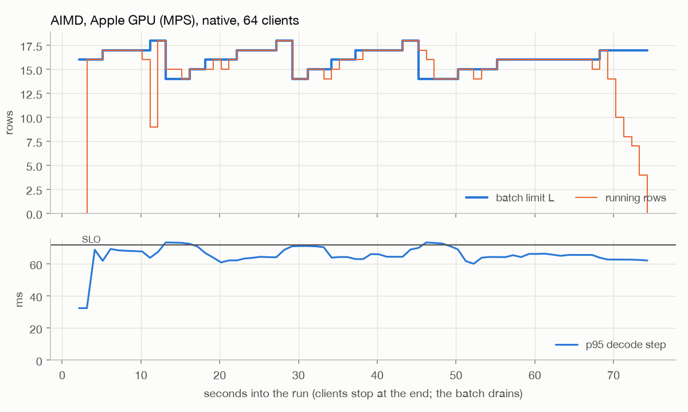
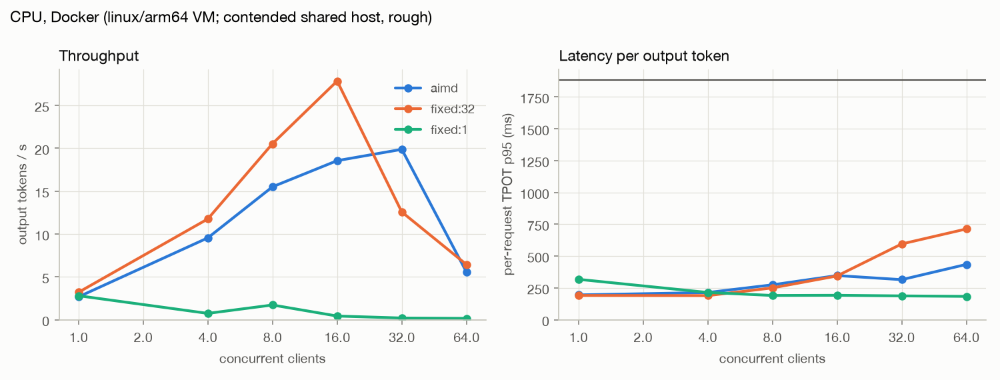
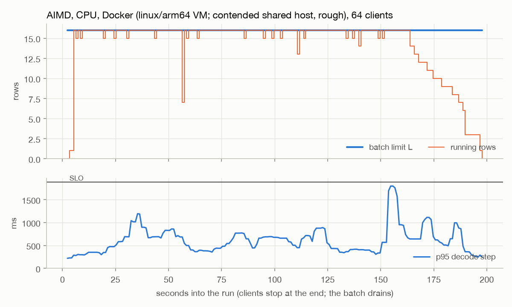
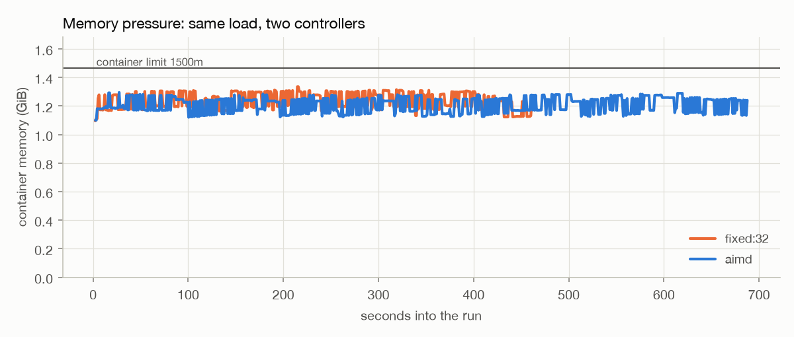

# Benchmark results

Generated by `bench/report.py` from `bench/results/*.json`; don't edit by hand.

Method: `bench/loadgen.py` runs a closed loop of N streaming clients for a fixed duration after a warm-up, per controller mode. Prompts come from `bench/prompts.jsonl`, sampled with temperature 0.7 and a per-request seed. TTFT is the time to the first content chunk as seen by the client. Request TPOT is client-side: (last token time - first token time) / (tokens - 1) for each request, so it includes prefill stalls from other requests joining the batch. SLO attainment is the share of requests whose request TPOT is at or under the SLO. The SLO is calibrated per target before the sweep as a fixed multiple of the median request TPOT of a single client with batch size 1.

## Apple GPU (MPS), native

Model `smollm2-135m` (HuggingFaceTB/SmolLM2-135M-Instruct), max_tokens 128, 45 s per point after 5 s warm-up. SLO 71.9 ms = 3.0 x 23.98 ms single-client median.

Memory probe before the run: limit 3.27 GiB, headroom 0.92 (mps(min(recommended_max, used+os_available))). Host swap: total = 13312.00M  used = 12288.25M  free = 1023.75M  (encrypted). Warnings: MPS memory limit is only 3.27 GiB; other processes are holding unified memory

Host: Apple M1 Pro, 16.0 GB, Darwin 26.5.1; power: Now drawing from 'AC Power'; lease holder: localhost-ai-bench; containers running at record time: leasing-edge-1, leasing-postgres-1, leasing-mailpit-1, creative-ai-local-postgres-1

| controller | clients | req/s | output tok/s | TTFT p50 / p95 (ms) | request TPOT p50 / p95 (ms) | SLO attainment | errors | host CPU idle before |
|---|---:|---:|---:|---:|---:|---:|---:|---:|
| fixed:1 | 1 | 0.40 | 41 | 36 / 41 | 23.8 / 24.4 | 100% | 0 | 55% |
| fixed:1 | 4 | 0.33 | 33 | 9327 / 9493 | 24.3 / 24.6 | 100% | 0 | 62% |
| fixed:1 | 8 | 0.32 | 32 | 15621 / 18535 | 23.6 / 24.1 | 100% | 0 | 58% |
| fixed:1 | 16 | 0.28 | 20 | 25436 / 36056 | 23.0 / 23.6 | 100% | 0 | 73% |
| fixed:1 | 32 | 0.17 | 18 | 67294 / 70945 | 23.5 / 23.7 | 100% | 0 | 70% |
| fixed:1 | 64 | 0.11 | 10 | 143210 / 147479 | 23.4 / 23.8 | 100% | 0 | 68% |
| fixed:32 | 1 | 0.48 | 42 | 37 / 44 | 23.5 / 23.8 | 100% | 0 | 67% |
| fixed:32 | 4 | 1.03 | 101 | 71 / 154 | 36.9 / 40.2 | 100% | 0 | 67% |
| fixed:32 | 8 | 1.50 | 148 | 78 / 162 | 47.5 / 51.1 | 100% | 0 | 67% |
| fixed:32 | 16 | 1.94 | 183 | 100 / 482 | 72.1 / 78.9 | 48% | 0 | 65% |
| fixed:32 | 32 | 2.47 | 233 | 142 / 360 | 107.9 / 117.0 | 1% | 0 | 67% |
| fixed:32 | 64 | 2.18 | 207 | 9851 / 11462 | 103.9 / 110.3 | 3% | 0 | 67% |
| aimd | 1 | 0.51 | 41 | 41 / 51 | 23.6 / 24.2 | 100% | 0 | 84% |
| aimd | 4 | 1.17 | 103 | 73 / 87 | 35.8 / 37.7 | 100% | 0 | 84% |
| aimd | 8 | 1.50 | 156 | 79 / 188 | 45.1 / 46.8 | 100% | 0 | 81% |
| aimd | 16 | 1.95 | 190 | 107 / 1817 | 67.7 / 71.7 | 95% | 0 | 82% |
| aimd | 32 | 1.87 | 171 | 7155 / 8448 | 66.5 / 75.7 | 82% | 0 | 85% |
| aimd | 64 | 1.59 | 151 | 19566 / 21641 | 67.8 / 72.5 | 93% | 0 | 82% |

- fixed:1: peak 41 tok/s at 1 clients, SLO attainment 100% there.
- fixed:32: peak 233 tok/s at 32 clients, SLO attainment 1% there.
- aimd: peak 190 tok/s at 16 clients, SLO attainment 95% there.

## CPU, Docker (linux/arm64 VM; contended shared host, rough)

Model `smollm2-135m` (HuggingFaceTB/SmolLM2-135M-Instruct), max_tokens 128, 45 s per point after 5 s warm-up. SLO 1883.2 ms = 3.0 x 627.72 ms single-client median.

Memory probe before the run: limit 4.00 GiB, headroom 0.72 (cgroup.memory). Host swap: total = 17408.00M  used = 16993.56M  free = 414.44M  (encrypted).

Host: Apple M1 Pro, 16.0 GB, Darwin 26.5.1; power: Now drawing from 'AC Power'; lease holder: localhost-ai-bench; containers running at record time: lhai-edge-1, lhai-server-1, lhai-prometheus-1, lhai-grafana-1, summerand-api-demo-1, summerand-pipeline-demo-1, summerand-postgres-1, summerand-redpanda-1, leasing-edge-1, leasing-postgres-1, leasing-mailpit-1, creative-ai-local-postgres-1

These numbers are rough. Other agents' containers and builds shared the Docker VM and the host during this sweep (host CPU idle before each point ranged 35-69%; see `manifest` in `bench/results/cpu-docker.json`). The single-client baseline used for calibration was measured under that load, so the calibrated SLO (1883.2 ms) is loose and every point meets it: this sweep shows throughput scaling with batch size on CPU, not the controller's SLO behaviour.

| controller | clients | req/s | output tok/s | TTFT p50 / p95 (ms) | request TPOT p50 / p95 (ms) | SLO attainment | errors | host CPU idle before |
|---|---:|---:|---:|---:|---:|---:|---:|---:|
| fixed:1 | 1 | 0.02 | 3 | 297 / 297 | 317.4 / 317.4 | 100% | 0 | 40% |
| fixed:1 | 4 | 0.01 | 1 | 121777 / 121777 | 214.2 / 214.2 | 100% | 0 | 35% |
| fixed:1 | 8 | 0.02 | 2 | 92354 / 101870 | 185.2 / 190.6 | 100% | 0 | 57% |
| fixed:1 | 16 | 0.01 | 0 | 263254 / 269821 | 178.9 / 192.0 | 100% | 0 | 68% |
| fixed:1 | 32 | 0.00 | 0 | 291407 / 291407 | 187.2 / 187.2 | 100% | 2 | 64% |
| fixed:1 | 64 | 0.00 | 0 | 284176 / 284176 | 183.4 / 183.4 | 100% | 0 | 63% |
| fixed:32 | 1 | 0.04 | 3 | 229 / 251 | 185.7 / 190.4 | 100% | 0 | 65% |
| fixed:32 | 4 | 0.12 | 12 | 230 / 343 | 184.6 / 189.5 | 100% | 0 | 67% |
| fixed:32 | 8 | 0.21 | 21 | 289 / 461 | 233.7 / 250.1 | 100% | 0 | 68% |
| fixed:32 | 16 | 0.28 | 28 | 406 / 810 | 305.1 / 343.8 | 100% | 0 | 66% |
| fixed:32 | 32 | 0.12 | 13 | 461 / 716 | 573.6 / 595.3 | 100% | 0 | 49% |
| fixed:32 | 64 | 0.07 | 6 | 74075 / 87183 | 374.3 / 713.1 | 100% | 0 | 52% |
| aimd | 1 | 0.02 | 3 | 210 / 210 | 194.9 / 194.9 | 100% | 0 | 47% |
| aimd | 4 | 0.09 | 10 | 360 / 433 | 211.8 / 213.6 | 100% | 0 | 69% |
| aimd | 8 | 0.16 | 16 | 427 / 431 | 244.8 / 274.1 | 100% | 0 | 48% |
| aimd | 16 | 0.15 | 19 | 348 / 471 | 336.9 / 347.0 | 100% | 0 | 65% |
| aimd | 32 | 0.20 | 20 | 28630 / 41592 | 289.6 / 314.8 | 100% | 0 | 66% |
| aimd | 64 | 0.05 | 6 | 120200 / 130695 | 390.1 / 434.5 | 100% | 0 | 63% |

- fixed:1: peak 3 tok/s at 1 clients, SLO attainment 100% there.
- fixed:32: peak 28 tok/s at 16 clients, SLO attainment 100% there.
- aimd: peak 20 tok/s at 32 clients, SLO attainment 100% there.

## NVIDIA CUDA

Not measured. This machine has no NVIDIA GPU. The CUDA probe, the cu126 image and `docker-compose.gpu.yml` are untested.

## Memory pressure (CPU, Docker)

Server container limited to 1500m (cgroup), 32 clients, max_tokens 512, 90 s, SLO set loose (1000 ms) so only memory matters. The server is recreated before each mode.

| controller | completed | errors | container after the run | peak memory seen by the probe | output tok/s |
|---|---:|---:|---|---:|---:|
| fixed:32 | 41 | 0 | running (exit 0) | 1.33 GiB | 20 |
| aimd | 28 | 12 | running (exit 0) | 1.29 GiB | 11 |

- fixed:32: batch limit 32-32, running rows at most 9, headroom 9%-25%, non-hold telemetry samples none, error kinds none.
- aimd: batch limit 1-13, running rows at most 9, headroom 12%-25%, non-hold telemetry samples {'clamp': 22, 'increase': 18}, error kinds {'ReadTimeout': 12}.

Host: Apple M1 Pro, 16.0 GB, Darwin 26.5.1; power: Now drawing from 'AC Power'; lease holder: localhost-ai-bench; containers running at record time: summerand-api-demo-1, summerand-pipeline-demo-1, summerand-postgres-1, summerand-redpanda-1, leasing-edge-1, leasing-postgres-1, leasing-mailpit-1, creative-ai-local-postgres-1
