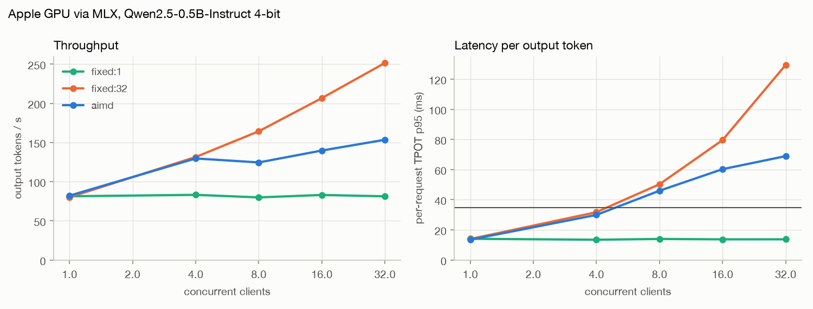
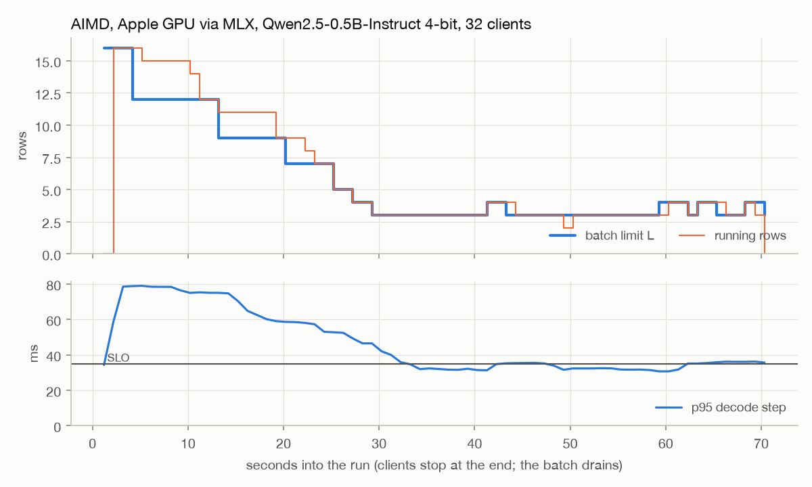
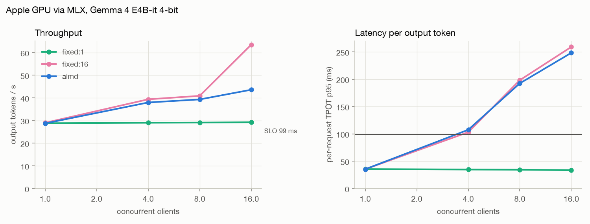
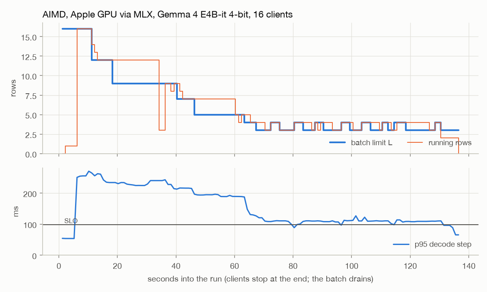
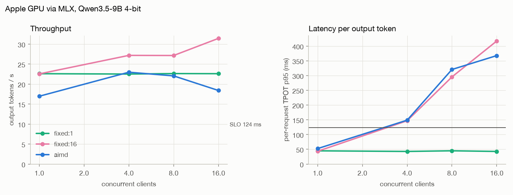
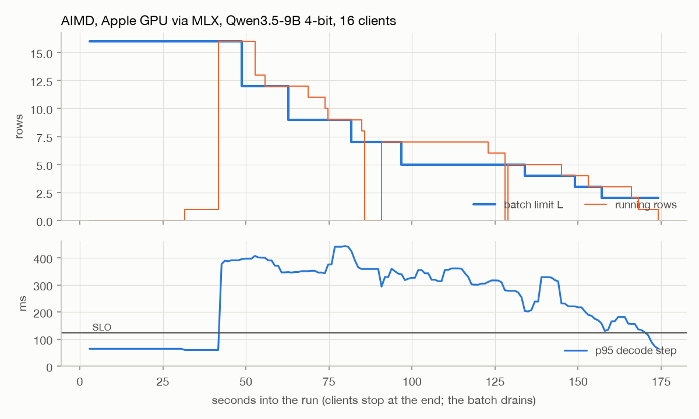
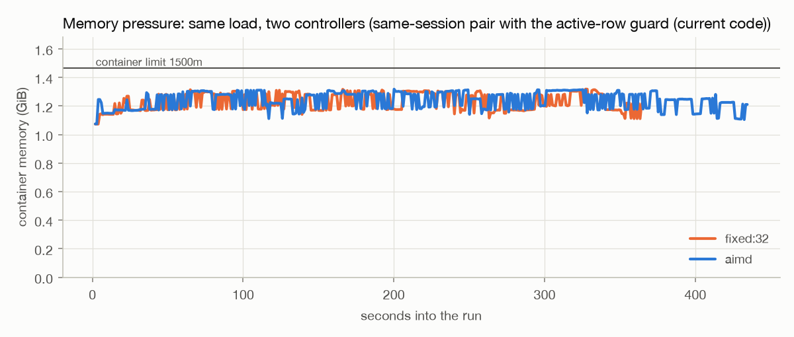
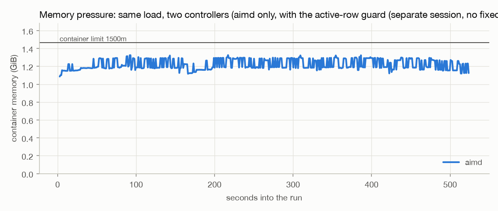
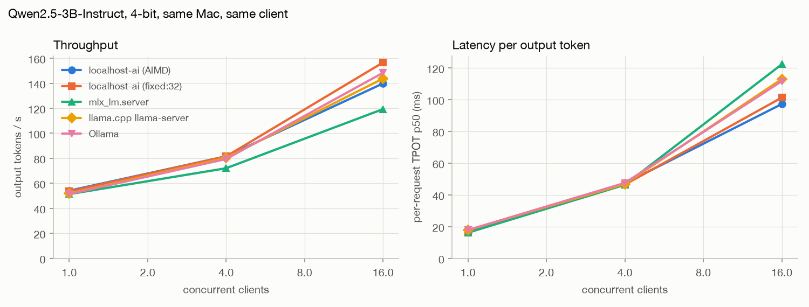

# Benchmark results

Generated by `bench/report.py` from `bench/results/*.json`; don't edit by hand.

Method: `bench/loadgen.py` runs a closed loop of N streaming clients for a fixed duration after a warm-up, per controller mode. Prompts come from `bench/prompts.jsonl`, sampled with temperature 0.7 and a per-request seed. TTFT is the time to the first content chunk as seen by the client. Request TPOT is client-side: (last token time - first token time) / (tokens - 1) for each request, so it includes prefill stalls from other requests joining the batch. SLO attainment is the share of requests whose request TPOT is at or under the SLO. The SLO is calibrated per target before the sweep as a fixed multiple of the median request TPOT of a single client with batch size 1.

## Apple GPU (MPS), native

Model `smollm2-135m` (HuggingFaceTB/SmolLM2-135M-Instruct), max_tokens 128, 45 s per point after 5 s warm-up. SLO 70.5 ms = 3.0 x 23.5 ms single-client median.

Memory probe before the run: limit 3.08 GiB, headroom 0.92 (mps(min(recommended_max, used+os_available))). Host swap: total = 8192.00M  used = 7866.38M  free = 325.62M  (encrypted). Warnings: MPS memory limit is only 3.08 GiB; other processes are holding unified memory

Host: arm64, macOS-26.5.1

| controller | clients | completed | req/s | output tok/s | TTFT p50 / p95 (ms) | request TPOT p50 / p95 (ms) | SLO attainment | errors | host CPU idle before |
|---|---:|---:|---:|---:|---:|---:|---:|---:|---:|
| fixed:1 | 1 | 15 | 0.33 | 38 | 44 / 91 | 24.1 / 33.1 | 100% | 0 | 46% |
| fixed:1 | 4 | 18 | 0.40 | 44 | 8703 / 8969 | 22.5 / 23.2 | 100% | 0 | 81% |
| fixed:1 | 8 | 25 | 0.56 | 44 | 11072 / 17051 | 22.2 / 23.1 | 100% | 0 | 73% |
| fixed:1 | 16 | 20 | 0.44 | 41 | 27125 / 37641 | 23.9 / 25.3 | 100% | 0 | 76% |
| fixed:1 | 32 | 22 | 0.49 | 42 | 25549 / 46893 | 23.6 / 25.5 | 100% | 0 | 79% |
| fixed:1 | 64 | 20 | 0.44 | 44 | 23697 / 40485 | 22.4 / 23.4 | 100% | 0 | 73% |
| fixed:32 | 1 | 20 | 0.44 | 39 | 40 / 65 | 25.1 / 27.0 | 100% | 0 | 75% |
| fixed:32 | 4 | 48 | 1.07 | 105 | 81 / 312 | 37.4 / 43.4 | 100% | 0 | 67% |
| fixed:32 | 8 | 78 | 1.73 | 171 | 82 / 570 | 45.8 / 50.4 | 100% | 0 | 54% |
| fixed:32 | 16 | 106 | 2.36 | 229 | 111 / 701 | 68.8 / 78.9 | 69% | 0 | 69% |
| fixed:32 | 32 | 145 | 3.22 | 327 | 161 / 448 | 96.0 / 101.0 | 0% | 0 | 81% |
| fixed:32 | 64 | 154 | 3.42 | 339 | 8514 / 12352 | 93.6 / 100.6 | 1% | 0 | 83% |
| aimd | 1 | 25 | 0.56 | 44 | 35 / 45 | 22.0 / 23.4 | 100% | 0 | 80% |
| aimd | 4 | 62 | 1.38 | 120 | 66 / 110 | 32.5 / 35.4 | 100% | 0 | 84% |
| aimd | 8 | 81 | 1.80 | 186 | 77 / 229 | 42.5 / 45.1 | 100% | 0 | 82% |
| aimd | 16 | 95 | 2.11 | 215 | 905 / 3899 | 60.5 / 68.0 | 99% | 0 | 93% |
| aimd | 32 | 107 | 2.38 | 226 | 7620 / 10055 | 60.4 / 68.3 | 95% | 0 | 83% |
| aimd | 64 | 96 | 2.13 | 213 | 21055 / 25524 | 60.8 / 70.4 | 95% | 0 | 78% |

- fixed:1: peak throughput was 44 tok/s at 8 clients; 100% met the SLO at that point.
- fixed:32: peak throughput was 339 tok/s at 64 clients; 1% met the SLO at that point.
- aimd: peak throughput was 226 tok/s at 32 clients; 95% met the SLO at that point.

## Apple GPU via MLX, Qwen2.5-0.5B-Instruct 4-bit

Model `qwen2.5-0.5b-mlx4` (mlx-community/Qwen2.5-0.5B-Instruct-4bit), max_tokens 128, 45 s per point after 5 s warm-up. SLO 34.8 ms = 3.0 x 11.59 ms single-client median.

Memory probe before the run: limit 11.23 GiB, headroom 0.98 (mlx(min(recommended_max, used+os_available))). Host swap: total = 2048.00M  used = 1044.06M  free = 1003.94M  (encrypted).

Host: Apple M1 Pro, 16.0 GB, Darwin 26.5.1, power: Now drawing from 'AC Power'

MLX backend, mlx4 weights, float16 activations. KV 12 KiB per token. MLX active memory before the run: 0.26 GiB. Highest active memory in any telemetry sample during the sweep: 0.44 GiB; lowest headroom 96% of the probe's limit.

| controller | clients | completed | req/s | output tok/s | TTFT p50 / p95 (ms) | request TPOT p50 / p95 (ms) | SLO attainment | errors | host CPU idle before |
|---|---:|---:|---:|---:|---:|---:|---:|---:|---:|
| fixed:1 | 1 | 32 | 0.71 | 81 | 35 / 51 | 11.8 / 14.1 | 100% | 0 | 86% |
| fixed:1 | 4 | 32 | 0.71 | 83 | 4281 / 5086 | 11.5 / 13.4 | 100% | 0 | 83% |
| fixed:1 | 8 | 34 | 0.76 | 80 | 8885 / 10436 | 12.2 / 14.0 | 100% | 0 | 86% |
| fixed:1 | 16 | 39 | 0.87 | 83 | 16595 / 18024 | 11.5 / 13.7 | 100% | 0 | 79% |
| fixed:1 | 32 | 34 | 0.76 | 81 | 26084 / 40639 | 11.9 / 13.7 | 100% | 0 | 86% |
| fixed:32 | 1 | 34 | 0.76 | 80 | 34 / 44 | 12.1 / 13.9 | 100% | 0 | 86% |
| fixed:32 | 4 | 59 | 1.31 | 131 | 37 / 74 | 30.1 / 31.7 | 100% | 0 | 85% |
| fixed:32 | 8 | 74 | 1.64 | 164 | 37 / 327 | 48.3 / 50.3 | 0% | 0 | 83% |
| fixed:32 | 16 | 82 | 1.82 | 207 | 48 / 589 | 77.3 / 79.6 | 0% | 0 | 85% |
| fixed:32 | 32 | 93 | 2.07 | 252 | 596 / 862 | 124.0 / 129.4 | 0% | 0 | 85% |
| aimd | 1 | 40 | 0.89 | 82 | 35 / 48 | 11.4 / 13.5 | 100% | 0 | 63% |
| aimd | 4 | 61 | 1.36 | 130 | 371 / 1161 | 25.6 / 29.9 | 100% | 0 | 86% |
| aimd | 8 | 53 | 1.18 | 125 | 3975 / 6281 | 26.4 / 46.0 | 83% | 0 | 85% |
| aimd | 16 | 59 | 1.31 | 140 | 8032 / 11773 | 28.1 / 60.3 | 59% | 0 | 85% |
| aimd | 32 | 69 | 1.53 | 153 | 13873 / 21005 | 47.2 / 68.9 | 42% | 0 | 86% |

- fixed:1: peak throughput was 83 tok/s at 4 clients; 100% met the SLO at that point.
- fixed:32: peak throughput was 252 tok/s at 32 clients; 0% met the SLO at that point.
- aimd: peak throughput was 153 tok/s at 32 clients; 42% met the SLO at that point.

## Apple GPU via MLX, Gemma 4 E4B-it 4-bit

Model `gemma-4-e4b-mlx4` (mlx-community/gemma-4-e4b-it-4bit), max_tokens 128, 90 s per point after 5 s warm-up. SLO 98.7 ms = 3.0 x 32.91 ms single-client median.

Memory probe before the run: limit 10.29 GiB, headroom 0.62 (mlx(min(recommended_max, used+os_available))). Host swap: total = 2048.00M  used = 687.00M  free = 1361.00M  (encrypted).

Host: Apple M1 Pro, 16.0 GB, Darwin 26.5.1, power: Now drawing from 'AC Power'

MLX backend, mlx4 weights, bfloat16 activations. KV 56 KiB per token. MLX active memory before the run: 3.91 GiB. Highest active memory in any telemetry sample during the sweep: 4.29 GiB; lowest headroom 54% of the probe's limit.

| controller | clients | completed | req/s | output tok/s | TTFT p50 / p95 (ms) | request TPOT p50 / p95 (ms) | SLO attainment | errors | host CPU idle before |
|---|---:|---:|---:|---:|---:|---:|---:|---:|---:|
| fixed:1 | 1 | 33 | 0.37 | 29 | 112 / 138 | 33.0 / 35.6 | 100% | 0 | 84% |
| fixed:1 | 4 | 28 | 0.31 | 29 | 9764 / 13644 | 33.2 / 34.6 | 100% | 0 | 86% |
| fixed:1 | 8 | 32 | 0.36 | 29 | 16637 / 27744 | 33.0 / 34.3 | 100% | 0 | 85% |
| fixed:1 | 16 | 32 | 0.36 | 29 | 36388 / 53576 | 32.7 / 33.5 | 100% | 0 | 85% |
| fixed:16 | 1 | 31 | 0.34 | 29 | 113 / 229 | 32.8 / 35.2 | 100% | 0 | 86% |
| fixed:16 | 4 | 36 | 0.40 | 39 | 222 / 741 | 98.5 / 103.1 | 53% | 0 | 86% |
| fixed:16 | 8 | 36 | 0.40 | 41 | 389 / 793 | 193.1 / 198.2 | 8% | 0 | 83% |
| fixed:16 | 16 | 50 | 0.56 | 63 | 1653 / 3591 | 247.8 / 259.1 | 0% | 0 | 86% |
| aimd | 1 | 32 | 0.36 | 29 | 114 / 297 | 32.8 / 35.3 | 100% | 0 | 57% |
| aimd | 4 | 33 | 0.37 | 38 | 311 / 2342 | 99.4 / 107.5 | 39% | 0 | 82% |
| aimd | 8 | 31 | 0.34 | 39 | 2467 / 14852 | 125.9 / 192.4 | 29% | 0 | 62% |
| aimd | 16 | 44 | 0.49 | 44 | 4282 / 32815 | 189.5 / 248.3 | 11% | 0 | 78% |

- fixed:1: peak throughput was 29 tok/s at 16 clients; 100% met the SLO at that point.
- fixed:16: peak throughput was 63 tok/s at 16 clients; 0% met the SLO at that point.
- aimd: peak throughput was 44 tok/s at 16 clients; 11% met the SLO at that point.

## Apple GPU via MLX, Qwen3.5-9B 4-bit

Model `qwen3.5-9b-mlx4` (mlx-community/Qwen3.5-9B-MLX-4bit), max_tokens 128, 90 s per point after 5 s warm-up. SLO 123.5 ms = 3.0 x 41.18 ms single-client median.

Memory probe before the run: limit 10.12 GiB, headroom 0.54 (mlx(min(recommended_max, used+os_available))). Host swap: total = 2048.00M  used = 777.25M  free = 1270.75M  (encrypted).

Host: Apple M1 Pro, 16.0 GB, Darwin 26.5.1, power: Now drawing from 'AC Power'

MLX backend, mlx4 weights, bfloat16 activations. KV 32 KiB per token, plus 49 MiB of recurrent state per row. MLX active memory before the run: 4.69 GiB. Highest active memory in any telemetry sample during the sweep: 5.58 GiB; lowest headroom 47% of the probe's limit.

| controller | clients | completed | req/s | output tok/s | TTFT p50 / p95 (ms) | request TPOT p50 / p95 (ms) | SLO attainment | errors | host CPU idle before |
|---|---:|---:|---:|---:|---:|---:|---:|---:|---:|
| fixed:1 | 1 | 19 | 0.21 | 23 | 254 / 294 | 41.2 / 44.9 | 100% | 0 | 85% |
| fixed:1 | 4 | 17 | 0.19 | 23 | 17038 / 17698 | 41.8 / 42.9 | 100% | 0 | 86% |
| fixed:1 | 8 | 21 | 0.23 | 23 | 27241 / 36322 | 41.1 / 45.0 | 100% | 0 | 86% |
| fixed:1 | 16 | 21 | 0.23 | 23 | 47624 / 70603 | 41.0 / 42.9 | 100% | 0 | 85% |
| fixed:16 | 1 | 19 | 0.21 | 23 | 255 / 821 | 41.4 / 43.5 | 100% | 0 | 85% |
| fixed:16 | 4 | 19 | 0.21 | 27 | 549 / 1856 | 144.1 / 146.9 | 0% | 0 | 94% |
| fixed:16 | 8 | 20 | 0.22 | 27 | 1279 / 1852 | 284.3 / 295.5 | 0% | 0 | 77% |
| fixed:16 | 16 | 18 | 0.20 | 31 | 15133 / 15148 | 405.6 / 417.2 | 0% | 0 | 77% |
| aimd | 1 | 16 | 0.18 | 17 | 325 / 5190 | 43.7 / 52.4 | 100% | 0 | 78% |
| aimd | 4 | 14 | 0.15 | 23 | 1811 / 11597 | 145.6 / 148.9 | 36% | 0 | 56% |
| aimd | 8 | 16 | 0.18 | 22 | 10304 / 11454 | 315.8 / 320.7 | 0% | 0 | 70% |
| aimd | 16 | 16 | 0.18 | 18 | 39412 / 39447 | 342.4 / 367.8 | 0% | 0 | 66% |

- fixed:1: peak throughput was 23 tok/s at 8 clients; 100% met the SLO at that point.
- fixed:16: peak throughput was 31 tok/s at 16 clients; 0% met the SLO at that point.
- aimd: peak throughput was 23 tok/s at 4 clients; 36% met the SLO at that point.

## CPU, Docker (linux/arm64 VM; contended shared host, rough)

Model `smollm2-135m` (HuggingFaceTB/SmolLM2-135M-Instruct), max_tokens 128, 30 s per point after 5 s warm-up. SLO 635.4 ms = 3.0 x 211.79 ms single-client median.

Memory probe before the run: limit 4.00 GiB, headroom 0.73 (cgroup.memory). Host swap: total = 12288.00M  used = 11294.25M  free = 993.75M  (encrypted).

Host: arm64, macOS-26.5.1

These numbers are rough. Other workloads were running on the machine and in the Docker VM during this sweep (host CPU idle before each point ranged 0-83%). The single-client baseline used for calibration was measured under that load, which sets the SLO (635.4 ms); 8 of 8 points with completed requests meet it for 99%+ of them (1 point(s) completed no request inside the window). Across the AIMD runs the batch limit took 1 distinct value(s): stayed at 16. The sweep never had more clients than AIMD's starting limit, so its batch was never saturated and every AIMD point stayed under the SLO: there was nothing to adapt to, and AIMD behaved like a fixed batch of 16 here. This sweep is not evidence for or against the controller.

| controller | clients | completed | req/s | output tok/s | TTFT p50 / p95 (ms) | request TPOT p50 / p95 (ms) | SLO attainment | errors | host CPU idle before |
|---|---:|---:|---:|---:|---:|---:|---:|---:|---:|
| fixed:1 | 1 | 1 | 0.03 | 4 | 670 / 670 | 254.2 / 254.2 | 100% | 0 | 0% |
| fixed:1 | 4 | 0 | 0.00 | 3 | n/a / n/a | n/a / n/a | n/a | 0 | 59% |
| fixed:1 | 8 | 2 | 0.07 | 4 | 3584 / 5904 | 273.8 / 281.4 | 100% | 0 | 0% |
| fixed:8 | 1 | 1 | 0.03 | 5 | 264 / 264 | 205.8 / 205.8 | 100% | 0 | 48% |
| fixed:8 | 4 | 5 | 0.17 | 21 | 786 / 786 | 189.3 / 190.4 | 100% | 0 | 62% |
| fixed:8 | 8 | 10 | 0.33 | 36 | 851 / 1406 | 221.7 / 225.1 | 100% | 0 | 73% |
| aimd | 1 | 1 | 0.03 | 6 | 199 / 199 | 180.1 / 180.1 | 100% | 0 | 72% |
| aimd | 4 | 5 | 0.17 | 22 | 702 / 702 | 181.5 / 185.0 | 100% | 0 | 65% |
| aimd | 8 | 10 | 0.33 | 37 | 883 / 885 | 213.7 / 214.3 | 100% | 0 | 83% |

- fixed:1: peak throughput was 4 tok/s at 8 clients; 100% met the SLO at that point.
- fixed:8: peak throughput was 36 tok/s at 8 clients; 100% met the SLO at that point.
- aimd: peak throughput was 37 tok/s at 8 clients; 100% met the SLO at that point.

## MLX presets, runner only (no HTTP, no controller)

`bench/mlx_direct.py` loads the preset, then prefills a fixed batch of prompts from `bench/prompts.jsonl` and runs 128 greedy decode steps with EOS ignored. Memory is MLX's allocator (active = live arrays including weights; peak = high-water mark since the last reset).

| preset | load | active after load | peak during load | KV per token | recurrent state per row | Metal working set | answer to "capital of France" |
|---|---:|---:|---:|---:|---:|---:|---|
| qwen2.5-0.5b-mlx4 | 0.3 s | 0.26 GiB | 0.28 GiB | 12 KiB | 0 | 11.84 GiB | 'Paris' |
| gemma-4-e4b-mlx4 | 2.0 s | 3.91 GiB | 3.96 GiB | 56 KiB | 0 | 11.84 GiB | 'Paris' |
| qwen3.5-9b-mlx4 | 1.8 s | 4.69 GiB | 4.87 GiB | 32 KiB | 49 MiB | 11.84 GiB | 'Paris' |

| preset | batch | prefill | decode step | step vs batch 1 | decode tok/s (all rows) | peak memory |
|---|---:|---:|---:|---:|---:|---:|
| qwen2.5-0.5b-mlx4 | 1 | 0.02 s | 6.3 ms | 1.0x | 158 | 0.33 GiB |
| qwen2.5-0.5b-mlx4 | 4 | 0.14 s | 12.4 ms | 2.0x | 323 | 0.66 GiB |
| qwen2.5-0.5b-mlx4 | 8 | 0.25 s | 16.2 ms | 2.6x | 494 | 0.99 GiB |
| qwen2.5-0.5b-mlx4 | 16 | 0.47 s | 18.2 ms | 2.9x | 881 | 1.04 GiB |
| gemma-4-e4b-mlx4 | 1 | 0.10 s | 26.6 ms | 1.0x | 38 | 3.96 GiB |
| gemma-4-e4b-mlx4 | 4 | 0.93 s | 77.6 ms | 2.9x | 52 | 4.49 GiB |
| gemma-4-e4b-mlx4 | 8 | 1.82 s | 145.5 ms | 5.5x | 55 | 4.53 GiB |
| gemma-4-e4b-mlx4 | 16 | 3.38 s | 153.3 ms | 5.8x | 104 | 4.65 GiB |
| qwen3.5-9b-mlx4 | 1 | 0.27 s | 38.9 ms | 1.0x | 26 | 4.84 GiB |
| qwen3.5-9b-mlx4 | 4 | 2.92 s | 130.2 ms | 3.3x | 31 | 5.59 GiB |
| qwen3.5-9b-mlx4 | 8 | 5.44 s | 236.8 ms | 6.1x | 34 | 6.12 GiB |
| qwen3.5-9b-mlx4 | 16 | 10.23 s | 248.4 ms | 6.4x | 64 | 6.93 GiB |

Host: Apple M1 Pro, 16.0 GB, Darwin 26.5.1, power: Now drawing from 'AC Power'

### 4-bit matmul cost against rows

`bench/mlx_qmm.py` times `mx.quantized_matmul` (MLX 0.32.2, 4-bit, group size 64) on 20 distinct 12288 x 4096 weight matrices (0.57 GB, more than the GPU caches hold), with one token per row as in a decode step. "Weight GB/s" is the weight bytes divided by the time, so it counts each weight once however many rows share it.

| rows | time for all matrices | vs 1 row | weight GB/s |
|---:|---:|---:|---:|
| 1 | 4.29 ms | 1.0x | 132 |
| 2 | 7.86 ms | 1.8x | 72 |
| 4 | 14.67 ms | 3.4x | 39 |
| 8 | 28.11 ms | 6.6x | 20 |
| 9 | 28.23 ms | 6.6x | 20 |
| 12 | 28.45 ms | 6.6x | 20 |
| 16 | 28.42 ms | 6.6x | 20 |
| 32 | 26.44 ms | 6.2x | 21 |
| 64 | 53.78 ms | 12.5x | 10 |

Up to 8 rows the time grows about in proportion to the row count, so each extra row costs close to another full read of the weights; from 9 to 32 rows it stays at 26-28 ms, and at 64 rows it is 54 ms. The decode step of a large preset follows the same shape in the table above, so on this machine batching those pays off only past that point.

Host: Apple M1 Pro, 16.0 GB, Darwin 26.5.1, power: Now drawing from 'AC Power'

## Prefix caching, shared system prompt

`bench/prefix.sh` runs the same sweep twice, with `LHAI_PREFIX_CACHE` off and on. Every request sends `bench/system_prompt.txt` as its system message and one of the usual prompts as the user message, so the prompts share a long common prefix. The server finds it after the first two requests and stores it once; later rows prefill only their own suffix. TTFT here includes the wait in the queue.

### SmolLM2-135M on the Apple GPU (MPS, torch runner)

Model `smollm2-135m`, max_tokens 128, 30 s per point, modes fixed:16. Stored prefixes held up to 16.9 MiB; by the end 174,020 prompt tokens had been served from them.

| controller | clients | TTFT p50 off / on (ms) | TTFT p95 off / on (ms) | output tok/s off / on | completed off / on |
|---|---:|---:|---:|---:|---:|
| fixed:16 | 1 | 115 / 34 | 126 / 143 | 45 / 46 | 16 / 17 |
| fixed:16 | 4 | 156 / 76 | 402 / 181 | 97 / 107 | 34 / 35 |
| fixed:16 | 8 | 164 / 88 | 812 / 291 | 146 / 169 | 49 / 54 |
| fixed:16 | 16 | 318 / 126 | 2050 / 740 | 194 / 220 | 48 / 68 |

Host: Apple M1 Pro, 16.0 GB, Darwin 26.5.1, power: Now drawing from 'AC Power'

### Qwen3.5-9B 4-bit on the Apple GPU (MLX runner)

Model `qwen3.5-9b-mlx4`, max_tokens 128, 60 s per point, modes fixed:8. Stored prefixes held up to 81.1 MiB; by the end 82,574 prompt tokens had been served from them.

| controller | clients | TTFT p50 off / on (ms) | TTFT p95 off / on (ms) | output tok/s off / on | completed off / on |
|---|---:|---:|---:|---:|---:|
| fixed:8 | 1 | 4746 / 260 | 4819 / 265 | 8 / 22 | 8 / 22 |
| fixed:8 | 4 | 9859 / 369 | 18297 / 978 | 8 / 24 | 6 / 27 |
| fixed:8 | 8 | 28958 / 547 | 39612 / 3151 | 7 / 25 | 2 / 22 |

Host: Apple M1 Pro, 16.0 GB, Darwin 26.5.1, power: Now drawing from 'AC Power'

## NVIDIA CUDA

Not measured. This machine has no NVIDIA GPU. The CUDA probe, the cu126 image and `docker-compose.gpu.yml` are untested.

## Memory pressure (CPU, Docker)

### Same-session pair with the active-row guard (current code)

Throughput is the server's token counter over the load window. "Completed" and TTFT only count requests that finished inside that window; with 512-token requests on a slow CPU most were still running at the deadline, so those samples are small.

Server container limited to 1500m (cgroup), 32 clients, max_tokens 512, 60 s, SLO set loose (1000 ms) so only memory matters. The server is recreated before each mode.

| controller | completed | errors | container after the run | peak memory seen by the probe | output tok/s | TTFT p95 |
|---|---:|---:|---|---:|---:|---:|
| fixed:32 | 7 | 0 | not OOM-killed | 1.32 GiB | 32 | 9 s |
| aimd | 5 | 0 | not OOM-killed | 1.32 GiB | 37 | 2 s |

- fixed:32: batch limit stayed at 32, running rows at most 11, headroom 10%-27%, non-hold telemetry samples none, error kinds none.
- aimd: batch limit 2 to 15, running rows at most 11, headroom 10%-27%, non-hold telemetry samples {'clamp': 11, 'increase': 6}, error kinds none.

Host: arm64, macOS-26.5.1

### After the KV-ceiling fix, before the guard

Throughput in this run is the older client-side count (tokens of requests that started after the warm-up), not the server counter used above.

Server container limited to 1500m (cgroup), 32 clients, max_tokens 512, 60 s, SLO set loose (1000 ms) so only memory matters. The server is recreated before each mode.

| controller | completed | errors | container after the run | peak memory seen by the probe | output tok/s | TTFT p95 |
|---|---:|---:|---|---:|---:|---:|
| fixed:32 | 38 | 0 | not OOM-killed | 1.33 GiB | 22 | 283 s |
| aimd | 28 | 9 | not OOM-killed | 1.33 GiB | 11 | 530 s |

- fixed:32: batch limit stayed at 32, running rows at most 9, headroom 9%-26%, non-hold telemetry samples none, error kinds none.
- aimd: batch limit 1 to 11, running rows at most 8, headroom 9%-24%, non-hold telemetry samples {'clamp': 17, 'mem_decrease': 1, 'increase': 17}, error kinds {'ReadTimeout': 9}.

Host: arm64, macOS-26.5.1

### AIMD only, with the active-row guard (separate session, no fixed baseline)

Only `aimd` ran in this session, so there is no same-session baseline; the other runs in this section used different host windows and aren't comparable to it. Requests could keep draining after the load window ends, so TTFT p95 (398 s) includes long queue waits.

Throughput in this run is the older client-side count (tokens of requests that started after the warm-up), not the server counter used above.

Server container limited to 1500m (cgroup), 32 clients, max_tokens 512, 60 s, SLO set loose (1000 ms) so only memory matters. The server is recreated before each mode.

| controller | completed | errors | container after the run | peak memory seen by the probe | output tok/s | TTFT p95 |
|---|---:|---:|---|---:|---:|---:|
| aimd | 35 | 0 | not OOM-killed | 1.33 GiB | 18 | 398 s |

- aimd: batch limit 1 to 14, running rows at most 9, headroom 9%-26%, non-hold telemetry samples {'clamp': 17, 'mem_decrease': 7, 'increase': 10}, error kinds none.

Host: arm64, macOS-26.5.1

### Before the KV-ceiling fix (history)

Throughput in this run is the older client-side count (tokens of requests that started after the warm-up), not the server counter used above.

Server container limited to 1500m (cgroup), 32 clients, max_tokens 512, 90 s, SLO set loose (1000 ms) so only memory matters. The server is recreated before each mode.

| controller | completed | errors | container after the run | peak memory seen by the probe | output tok/s | TTFT p95 |
|---|---:|---:|---|---:|---:|---:|
| fixed:32 | 41 | 0 | not OOM-killed | 1.33 GiB | 20 | 306 s |
| aimd | 28 | 12 | not OOM-killed | 1.29 GiB | 11 | 584 s |

- fixed:32: batch limit stayed at 32, running rows at most 9, headroom 9%-25%, non-hold telemetry samples none, error kinds none.
- aimd: batch limit 1 to 13, running rows at most 9, headroom 12%-25%, non-hold telemetry samples {'clamp': 22, 'increase': 18}, error kinds {'ReadTimeout': 12}.

Host: Apple M1 Pro, 16.0 GB, Darwin 26.5.1, power: Now drawing from 'AC Power'

## Against other local servers (Qwen2.5-3B-Instruct, 4-bit)

`bench/baseline.py` starts each server in turn on the same Mac, warms it up, and drives it with the same closed loop: 1, 4, 16 streaming clients, 20 s per point after a 5 s warm-up, max_tokens 128, temperature 0.7, top-p 0.95, no seed, prompts from `bench/prompts.jsonl` in the same order for every engine. Each engine is configured for 32 parallel sequences of 2048 tokens. Everything is measured by the client: throughput counts completion tokens whose chunk arrived inside the window, TTFT is the first content chunk, TPOT is per request. Memory is the server's process tree, sampled every 250 ms.

Run design: trimmed: concurrency 1,4,16 with 20 s windows instead of the full 1,2,4,8,16,32 sweep at 30 s.

Engines and weights:

- localhost-ai (AIMD): localhost-ai c8bf056, mlx-community/Qwen2.5-3B-Instruct-4bit (qwen2.5-3b-mlx4), MLX 4-bit, group size 64.
- localhost-ai (fixed:32): localhost-ai c8bf056, mlx-community/Qwen2.5-3B-Instruct-4bit (qwen2.5-3b-mlx4), MLX 4-bit, group size 64.
- mlx_lm.server: mlx-lm 0.31.3, mlx-community/Qwen2.5-3B-Instruct-4bit (same files), MLX 4-bit, group size 64.
- llama.cpp llama-server: llama.cpp version: 0.5.0 (build 11146, commit 7fe450e19), Ollama's qwen2.5:3b-instruct GGUF blob, GGUF Q4_K_M.
- Ollama: ollama version is 0.34.4, qwen2.5:3b-instruct, GGUF Q4_K_M.

What isn't equal:

- Quantization. The MLX engines run mlx-community's 4-bit conversion (affine, group size 64, a 1.74 GB file); llama.cpp and Ollama run the file behind Ollama's qwen2.5:3b-instruct tag, Q4_K_M (1.93 GB, some tensors kept at higher precision). They are different quantizations of the same model, so neither output quality nor speed is strictly like for like.
- Kernels. llama.cpp and Ollama use ggml's Metal kernels, the other three use MLX's. llama.cpp here is the Homebrew build; Ollama bundles its own ggml-based runner.
- Prompt caching. llama.cpp, Ollama and mlx_lm.server reuse the KV of a repeated prompt prefix by default; this server's prefix cache is off by default and was off here. With 32 prompts repeating, that helps their TTFT.
- Output lengths differ per engine (different samplers and quantizations stop at different places); the mean completion length is in the table.
- Memory. `footprint` is macOS's phys_footprint (what Activity Monitor shows), which includes Metal buffers. `rss` also counts resident file-backed pages; for llama.cpp and Ollama, which mmap the GGUF, it comes out about one weights-file larger than footprint, most likely the mapped file counted on top of the weights the GPU uses. Footprint is the column to compare.

| engine | clients | output tok/s | TTFT p50 / p99 (ms) | TPOT p50 / p99 (ms) | completed | mean tokens | peak footprint (GiB) | peak rss (GiB) | errors |
|---|---:|---:|---:|---:|---:|---:|---:|---:|---:|
| localhost-ai (AIMD) | 1 | 54 | 134 / 271 | 16.4 / 17.7 | 15 | 73 | 3.13 | 2.19 | 0 |
| localhost-ai (AIMD) | 4 | 82 | 144 / 545 | 47.1 / 53.8 | 19 | 82 | 3.61 | 2.21 | 0 |
| localhost-ai (AIMD) | 16 | 140 | 1288 / 2721 | 97.2 / 133.9 | 27 | 81 | 8.49 | 2.21 | 0 |
| localhost-ai (fixed:32) | 1 | 54 | 137 / 271 | 16.3 / 17.4 | 15 | 73 | 3.13 | 2.19 | 0 |
| localhost-ai (fixed:32) | 4 | 81 | 148 / 511 | 46.4 / 51.2 | 18 | 88 | 3.74 | 2.22 | 0 |
| localhost-ai (fixed:32) | 16 | 157 | 803 / 3533 | 101.3 / 137.3 | 31 | 76 | 8.29 | 2.28 | 0 |
| mlx_lm.server | 1 | 51 | 216 / 345 | 16.1 / 17.2 | 14 | 75 | 2.38 | 2.16 | 0 |
| mlx_lm.server | 4 | 72 | 570 / 933 | 46.3 / 55.0 | 19 | 83 | 2.69 | 2.21 | 0 |
| mlx_lm.server | 16 | 119 | 1639 / 3041 | 122.2 / 180.8 | 29 | 74 | 4.84 | 2.37 | 0 |
| llama.cpp llama-server | 1 | 52 | 86 / 233 | 17.8 / 18.5 | 15 | 70 | 2.40 | 4.24 | 0 |
| llama.cpp llama-server | 4 | 80 | 184 / 341 | 46.8 / 51.1 | 21 | 83 | 2.49 | 4.32 | 0 |
| llama.cpp llama-server | 16 | 144 | 592 / 1728 | 112.9 / 132.8 | 25 | 86 | 2.61 | 4.45 | 0 |
| Ollama | 1 | 51 | 88 / 234 | 17.8 / 20.1 | 14 | 74 | 2.42 | 4.30 | 0 |
| Ollama | 4 | 79 | 206 / 284 | 47.5 / 52.3 | 20 | 84 | 2.50 | 4.38 | 0 |
| Ollama | 16 | 148 | 559 / 1610 | 111.6 / 141.8 | 27 | 82 | 2.62 | 4.50 | 0 |

- 1 client: localhost-ai (AIMD) 54, localhost-ai (fixed:32) 54, llama.cpp llama-server 52, Ollama 51, mlx_lm.server 51 tok/s. Fastest: localhost-ai (AIMD).
- 16 clients: localhost-ai (fixed:32) 157, Ollama 148, llama.cpp llama-server 144, localhost-ai (AIMD) 140, mlx_lm.server 119 tok/s. Fastest: localhost-ai (fixed:32).

Host: Apple M1 Pro, 16.0 GB, Darwin 26.5.1, power: Now drawing from 'AC Power'

## Sampler CPU time

Found while setting up the comparison above: at temperature 0.7 the sampler sorted the whole vocabulary on the CPU for every sampled row, every step. `bench/sampler_bench.py` collects real next-token logits from `qwen2.5-3b-mlx4` (855 rows, vocabulary 151,936) and times the old full sort against the current sampler, which looks for the top-p nucleus among the top 256 logits (the median nucleus held 1 tokens, the largest 64). Unseeded rows draw from the candidates directly. Seeded rows rebuild the full sort's probability vector from the candidates, so a seed gives the same tokens as before, and fall back to the full sort when the nucleus doesn't fit, has tied logits or has a cumulative sum too close to top_p. Timing at temperature 0.7, top_p 0.95:

| rows sampled | full sort (ms) | seeded (ms) | unseeded (ms) |
|---:|---:|---:|---:|
| 1 | 12.05 | 5.21 | 0.98 |
| 8 | 29.23 | 24.28 | 2.47 |
| 32 | 113.95 | 79.39 | 7.16 |

Same-seed check: the tokens a seeded row draws, against the full sort, over the same logits, and how many rows took the full-sort fallback:

| setting | rows sampled | tokens compared | mismatches | full-sort rows |
|---|---:|---:|---:|---:|
| t0.7-p0.95 | 1 | 2565 | 0 | 105 (4%) |
| t0.7-p0.95 | 8 | 2544 | 0 | 102 (4%) |
| t0.7-p0.95 | 32 | 2496 | 0 | 90 (4%) |
| t1.0-p0.9 | 1 | 2565 | 0 | 159 (6%) |
| t1.0-p0.9 | 8 | 2544 | 0 | 153 (6%) |
| t1.0-p0.9 | 32 | 2496 | 0 | 138 (6%) |
| t0.8-p0.95-k40 | 1 | 2565 | 0 | 129 (5%) |
| t0.8-p0.95-k40 | 8 | 2544 | 0 | 123 (5%) |
| t0.8-p0.95-k40 | 32 | 2496 | 0 | 108 (4%) |
| t1.0-p1.0 | 1 | 2565 | 0 | 2565 (100%) |
| t1.0-p1.0 | 8 | 2544 | 0 | 2544 (100%) |
| t1.0-p1.0 | 32 | 2496 | 0 | 2496 (100%) |

With top_p 1.0 and no top-k there is no nucleus to look for, so every seeded row is sorted in full; unseeded rows at that setting sample the softmax directly.

Host: Apple M1 Pro, 16.0 GB, Darwin 26.5.1, power: Now drawing from 'AC Power'

## response_format overhead

`bench/json_overhead.py` decodes the same prompts through the scheduler with and without a JSON-schema constraint on `qwen2.5-3b-mlx4` (greedy, up to 160 tokens). The mask column is CPU time spent in the constraint per row per token: llguidance computing the allowed-token bitmask, unpacking it, masking the logits and advancing the matcher. Step time is the whole scheduler iteration. Building the llguidance tokenizer took 0.74 s on the first constrained request; compiling the schema for a request takes 0.4 ms after that.

| rows | constrained | decode steps | step (ms) | mask per row-token (ms) | finished with stop | parsed |
|---:|---|---:|---:|---:|---:|---:|
| 1 | no | 158 | 17.28 | n/a | 0 / 1 | n/a |
| 1 | yes | 158 | 17.25 | 0.476 | 0 / 1 | 0 |
| 1 | no | 158 | 16.16 | n/a | 0 / 1 | n/a |
| 1 | yes | 158 | 15.90 | 0.366 | 0 / 1 | 0 |
| 8 | no | 158 | 61.32 | n/a | 4 / 8 | n/a |
| 8 | yes | 158 | 73.57 | 0.233 | 4 / 8 | 4 |
| 8 | no | 158 | 61.05 | n/a | 4 / 8 | n/a |
| 8 | yes | 158 | 72.80 | 0.220 | 4 / 8 | 4 |

Host: Apple M1 Pro, 16.0 GB, Darwin 26.5.1, power: Now drawing from 'AC Power'

## Seeded and greedy determinism, Qwen3.5-9B 4-bit

`bench/seedcheck.py` runs the same prompts through the scheduler one at a time twice, then together at each width, once with every row admitted at the start and once with half the rows joining after four steps. A row counts as identical when its text matches the first solo run byte for byte (64 tokens, top_p 0.95, seed 1000 + row).

| temperature | run | rows | identical to solo |
|---:|---|---:|---:|
| 0.8 | solo again | 16 | 16 of 16 |
| 0.8 | batched | 2 | 1 of 2 |
| 0.8 | batched, half join late | 2 | 2 of 2 |
| 0.8 | batched | 8 | 3 of 8 |
| 0.8 | batched, half join late | 8 | 2 of 8 |
| 0.8 | batched | 9 | 3 of 9 |
| 0.8 | batched, half join late | 9 | 2 of 9 |
| 0.8 | batched | 16 | 4 of 16 |
| 0.8 | batched, half join late | 16 | 4 of 16 |
| 0 | solo again | 16 | 16 of 16 |
| 0 | batched | 2 | 1 of 2 |
| 0 | batched, half join late | 2 | 2 of 2 |
| 0 | batched | 8 | 3 of 8 |
| 0 | batched, half join late | 8 | 4 of 8 |
| 0 | batched | 9 | 3 of 9 |
| 0 | batched, half join late | 9 | 5 of 9 |
| 0 | batched | 16 | 9 of 16 |
| 0 | batched, half join late | 16 | 8 of 16 |

Solo runs repeat exactly, seeded or greedy. Batched rows do not, from two rows up. The two-row run where the second row joined late, so each row was prefilled alone, stayed identical, which points at the padded multi-row prefill; the 4-bit matmul also changes kernels with the row count (above). Once one token differs, the rest of the text follows it. Where byte-identical output matters, send requests one at a time or run the server with a fixed batch of 1.

Host: Apple M1 Pro, 16.0 GB, Darwin 26.5.1, power: Now drawing from 'AC Power'
