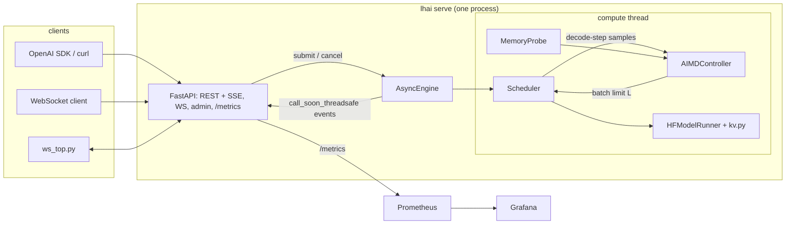

# Architecture

## Process and threads

One uvicorn worker. The model, the KV cache and the scheduler live in that process, so a second
worker would load a second model and split the batch. The API runs on the asyncio loop. The
scheduler runs on a dedicated compute thread (`engine/engine.py`) so a forward pass never blocks
the loop. Each request owns an `asyncio.Queue`; the compute thread pushes token/done/error events
into it with `loop.call_soon_threadsafe`. If the loop is gone the push cancels that request only.

## One scheduler iteration (`engine/scheduler.py`)

1. Drop cancelled requests (waiting or running). If a control interval has passed, read the memory
   probe, compute the KV ceiling and run the controller. A memory or OOM decision that lowers L
   below the running count preempts the newest rows right away. A clamp only blocks admission.
2. Admit from the FIFO queue while `running < L`, the padded prefill cost (rows x longest prompt)
   stays under `MAX_PREFILL_TOKENS_PER_STEP`, and the projected padded KV fits the budget from the
   last tick's reading. After an OOM, nothing is admitted until a running row finishes.
3. Prefill the admitted requests together (left-padded, explicit `position_ids`,
   `logits_to_keep=1`) and sample each one's first token.
4. Merge the new rows into the running batch: left-pad the shorter side along the sequence and
   concatenate on the batch dimension (TGI v1 style).
5. One decode step for every row. Its wall time, with the batch size at decode time, is the only
   sample the controller sees.
6. Filter finished rows out by index-select and trim columns that are padding in every row.

Every KV operation is in `engine/kv.py`. It wraps existing tensors in a `DynamicCache` without
copying and merges/filters in place layer by layer, so the peak during a merge is the merged
cache plus one layer. If a forward pass fails halfway (an OOM in layer 17), `kv.crop` cuts the
layers that already appended back to the old length.

## Out of memory

- An OOM in decode preempts the newest row by recompute (vLLM style). Its KV is dropped and it
  goes back to the front of the queue with its generated tokens and its sampler state. When it
  is admitted again, prompt plus generated tokens are prefilled, so the output is the same as an
  uninterrupted run. `tests/test_hf_equivalence.py` checks this on the real model.
- An OOM in merge or select drops the whole batch's KV and requeues every row for recompute.
- The controller halves L the moment an OOM is reported (at most once per interval) and blocks
  increases for 3 intervals.
- In a container the kernel may OOM-kill the process before PyTorch raises anything. That's what
  the memory-pressure benchmark measures.

## Memory probes (`memory.py`)

| device | used | limit | headroom |
|---|---|---|---|
| CUDA | total - headroom | `mem_get_info` total | driver free + (reserved - allocated) in PyTorch's cache |
| MPS | `current_allocated_memory` | min(`recommended_max_memory`, used + OS available + cached driver blocks) | limit - used |
| CPU in a container | cgroup v2 `memory.current - inactive_file` | `memory.max` | limit - used |
| CPU on a host | psutil total - available | psutil total | available |

On Apple silicon the GPU shares RAM with everything else, so the MPS limit moves with whatever
other programs hold. On a busy 16 GB Mac the limit can be a few GiB even though Metal reports
about 12 GiB. The benchmark preflight records the probe and host swap before every run.

NVML GPU utilization is reported only on NVIDIA. On MPS and CPU the utilization signal is
`lhai_engine_busy_ratio`, the share of wall time the compute thread spends in prefill and decode.

## Names for latency

| name | what it is | where |
|---|---|---|
| decode step | wall time of one batched decode step | controller input, `lhai_decode_step_seconds`, telemetry `decode_step_p95_ms` |
| controller p95 | p95 over the fresh samples behind the last decision | `lhai_controller_p95_seconds`, telemetry `controller_p95_ms` |
| iteration | prefill + decode of one scheduler iteration | `lhai_step_seconds`, telemetry `iteration_p95_ms` |
| request TPOT | (last token - first token) / (tokens - 1) for one request | `lhai_tpot_seconds`, response `timings.tpot_ms`, benchmark "request TPOT" |

Request TPOT is what a streaming user feels. It includes prefill stalls when other requests join
the batch, and those stalls are bounded by the prefill token budget, not by the controller.

## Docker

`docker-compose.yml` puts the server, Prometheus and Grafana on an `internal: true` network, so
none of them can reach the internet. The only container with published ports is `edge`, an
nginx TCP proxy that sits on both networks and forwards 127.0.0.1:8410/9410/3410 to them. Model
weights are mounted read-only from the host's `.models/`, filled by `make models`.
