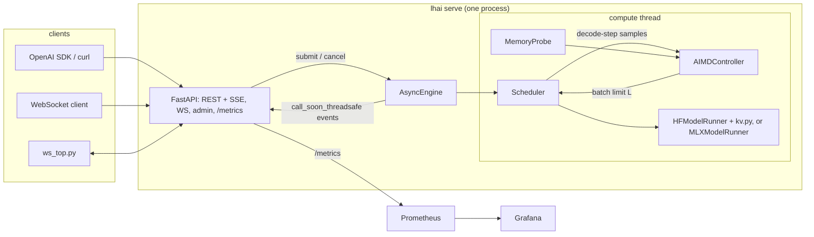

# Architecture

## Process and threads

One uvicorn worker. The model, the KV cache and the scheduler live in that process, so a second
worker would load a second model and split the batch. The API runs on the asyncio loop. The
scheduler runs on a dedicated compute thread (`engine/engine.py`) so a forward pass never blocks
the loop. Each request owns an `asyncio.Queue`; the compute thread pushes token/done/error events
into it with `loop.call_soon_threadsafe`. If the loop is gone the push cancels that request only.

## One scheduler iteration (`engine/scheduler.py`)

1. Drop cancelled requests (waiting or running). If a control interval has passed, read the memory
   probe, compute the KV ceiling and run the controller. A memory or OOM decision that lowers L
   below the running count preempts the newest rows right away. A clamp only blocks admission.
2. Admit from the FIFO queue while `running < L`, the padded prefill cost (rows x longest prompt)
   stays under `MAX_PREFILL_TOKENS_PER_STEP`, and the projected padded KV fits the budget from the
   last tick's reading. After an OOM, nothing is admitted until a running row finishes.
3. Prefill the admitted requests together (left-padded, explicit `position_ids`,
   `logits_to_keep=1`) and sample each one's first token.
4. Merge the new rows into the running batch: left-pad the shorter side along the sequence and
   concatenate on the batch dimension (TGI v1 style).
5. One decode step for every row. Its wall time, with the batch size at decode time, is the only
   sample the controller sees.
6. Filter finished rows out by index-select and trim columns that are padding in every row.

Every KV operation is in `engine/kv.py`. It wraps existing tensors in a `DynamicCache` without
copying and merges/filters in place layer by layer, so the peak during a merge is the merged
cache plus one layer. If a forward pass fails halfway (an OOM in layer 17), `kv.crop` cuts the
layers that already appended back to the old length.

## Out of memory

- An OOM in decode preempts the newest row by recompute (vLLM style). Its KV is dropped and it
  goes back to the front of the queue with its generated tokens and its sampler state. When it
  is admitted again, prompt plus generated tokens are prefilled, so the output is the same as an
  uninterrupted run. `tests/test_hf_equivalence.py` checks this on the real model.
- An OOM in merge or select drops the whole batch's KV and requeues every row for recompute.
  So does any decode OOM on the MLX backend (below). The rebuilt batch is capped at one row
  fewer than before, and admission holds at that size until a row finishes. Without the cap, a
  fixed limit re-admitted the same batch into the same OOM forever.
- The controller halves L the moment an OOM is reported (at most once per interval) and blocks
  increases for 3 intervals.
- In a container the kernel may OOM-kill the process before PyTorch raises anything. That's what
  the memory-pressure benchmark measures.

## Memory probes (`memory.py`)

| device | used | limit | headroom |
|---|---|---|---|
| CUDA | total - headroom | `mem_get_info` total | driver free + (reserved - allocated) in PyTorch's cache |
| MPS | `current_allocated_memory` | min(`recommended_max_memory`, used + OS available + cached driver blocks) | limit - used |
| MLX (`backend: mlx` presets) | `mx.get_active_memory()` | min(Metal `max_recommended_working_set_size`, used + OS available + `mx.get_cache_memory()`) | limit - used |
| CPU in a container | cgroup v2 `memory.current - inactive_file` | `memory.max` | limit - used |
| CPU on a host | psutil total - available | psutil total | available |

On Apple silicon the GPU shares RAM with everything else, so the MPS limit moves with whatever
other programs hold. On a busy 16 GB Mac the limit can be a few GiB even though Metal reports
about 12 GiB. The benchmark preflight records the probe and host swap before every run.

NVML GPU utilization is reported only on NVIDIA. On MPS and CPU the utilization signal is
`lhai_engine_busy_ratio`, the share of wall time the compute thread spends in prefill and decode.

## MLX backend (`engine/mlx_runner.py`)

PyTorch on MPS has no working 4-bit path here. bitsandbytes needs CUDA. With torchao 0.18 and
torch 2.14 on SmolLM2-135M, `Int4WeightOnlyConfig` needs a CUDA kernel library,
`Int8WeightOnlyConfig` ran but generated only end-of-text, and `IntxWeightOnlyConfig` (int4) was
slower than fp16, used more memory and answered wrongly.
Presets with `backend: mlx` load a pre-quantized mlx-community checkpoint with mlx-lm instead,
and `MLXModelRunner` gives the scheduler the same five operations as `HFModelRunner`:

- **prefill**: every prompt except its last token runs right-padded through mlx-lm's batch
  caches, with per-row lengths so padding is masked. `finalize` then rolls each row so the batch
  is left-padded. The last tokens run as one decode step, so every row's logits come from the
  same position.
- **merge / select**: each layer cache's `extend` and `filter`. `filter` also trims columns that
  are padding in every row.
- Logits come back as CPU float32 torch tensors, so sampling (and seeded sampling) is shared.

The caches are built from mlx-lm's public cache classes (`batch_cache`), not from its private
batch-generator helper. That helper, and `ArraysCache.merge` of empty caches, give recurrent
layers a zero `left_padding`, and `ArraysCache.make_mask` checks that before the prefill
lengths. For Qwen3.5 (gated-delta linear attention in 3 of every 4 layers) that fed the pad
tokens after each shorter prompt into its recurrent state. `tests/test_mlx_runner.py` builds a
tiny random Qwen3.5 and checks batched against one-at-a-time logits, which catches it (setting a
zero `left_padding` back in makes three of its cases fail). A chunked-prefill case checks that
the lengths also count down correctly when a long prompt spans several prefill chunks.

Gemma 4 E4B needs no special handling: its sliding-window layers get `BatchRotatingKVCache`
(window 512, no kept prefix) and its last 18 layers read an earlier layer's KV, so they have no
cache of their own. The tests use a tiny Gemma 4 with a 4-token window so both the prefill and
decode wrap it inside a mixed-length batch.

Differences from the torch path:

- **No crop after a failed step.** Recurrent state has no history to cut back to. If a forward
  pass fails, the batch is marked lost and the next decode/merge/select raises `CacheLost`, a
  `MemoryError`. The scheduler reads that as an OOM, drops the batch and recomputes every row.
- **Recompute costs the whole batch.** Because nothing can be cut back, one OOM re-prefills
  every running row, where the torch path re-prefills one. Snapshotting the caches before each
  step to allow a one-row preempt isn't worth it: mlx-lm updates KV buffers in place and the
  recurrent state is replaced each step, so a snapshot would mean copying the state every step.
- **Memory is priced per cache layout.** The KV ceiling and the admission budget work in bytes.
  The torch runner prices a row as tokens x `kv_bytes_per_token`. The MLX runner reads its layer
  layout off the live cache at load and prices a row padded to T tokens as
  `full x ceil256(T) + sliding x min(ceil256(T), window) + row_state`: full-attention layers
  grow with every token, sliding-window layers stop at their window, KV buffers are allocated in
  256-token steps, and linear-attention layers hold a fixed recurrent state per row. Layers that
  reuse another layer's KV (Gemma 4's last 18) have no cache and cost nothing. For Gemma 4 E4B at
  2048 tokens a flat per-token count would overstate a row about 2x; for a 50-token row it would
  understate it about 5x.
- **KV in use is read off the arrays.** The ceiling adds back the bytes the batch already holds,
  summed from the cache arrays' `nbytes` (`lhai_kv_cache_bytes`). After `select` trims padding
  columns the arrays are views of the old buffer, so the figure can sit a little below what is
  allocated until the next step reallocates. The probe reads the allocator either way.
- **OOM shows up late.** MLX raises `[metal::malloc] Attempting to allocate ...` for a single
  buffer larger than Metal allows, `[metal::malloc] Resource limit (499000) exceeded.` for too
  many buffers, and `[malloc] Unable to allocate N bytes.` when Metal can't hand out a buffer.
  All three count as OOM. Running out of unified memory usually means swapping first, so the
  probe watermarks and the KV ceiling do the protecting, not the exception path. Whether a real
  exhaustion surfaces as that last error or as a failed command buffer hasn't been tried here.
- **Wired memory.** On load the wired limit is raised to Metal's recommended working set, as
  mlx-lm's own generate does, so a large model's weights aren't paged out between steps. It's a
  cap, not a reservation.
- **Hot-swap frees first.** The old runner and tokenizer are dropped and MLX's buffer cache is
  cleared before the next model loads, after waiting for the compute thread to finish its step.
  Otherwise both sets of weights are resident during the load.

mlx-lm is pinned exactly (`mlx-lm==0.31.3`) because the batch cache classes are internals.

## Names for latency

| name | what it is | where |
|---|---|---|
| decode step | wall time of one batched decode step | controller input, `lhai_decode_step_seconds`, telemetry `decode_step_p95_ms` |
| controller p95 | p95 over the fresh samples behind the last decision | `lhai_controller_p95_seconds`, telemetry `controller_p95_ms` |
| iteration | prefill + decode of one scheduler iteration | `lhai_step_seconds`, telemetry `iteration_p95_ms` |
| request TPOT | (last token - first token) / (tokens - 1) for one request | `lhai_tpot_seconds`, response `timings.tpot_ms`, benchmark "request TPOT" |

Request TPOT is what a streaming user feels. It includes prefill stalls when other requests join
the batch, and those stalls are bounded by the prefill token budget, not by the controller.

## Docker

`docker-compose.yml` puts the server, Prometheus and Grafana on an `internal: true` network, so
none of them can reach the internet. The only container with published ports is `edge`, an
nginx TCP proxy that sits on both networks and forwards 127.0.0.1:8410/9410/3410 to them. Model
weights are mounted read-only from the host's `.models/`, filled by `make models`.
