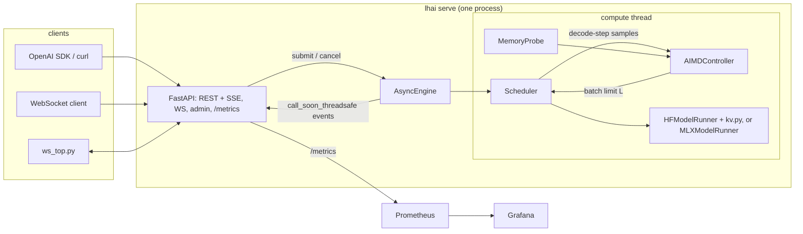

# Architecture

## Process and threads

One uvicorn worker. The model, the KV cache and the scheduler live in that process, so a second
worker would load a second model and split the batch. The API runs on the asyncio loop. The
scheduler runs on a dedicated compute thread (`engine/engine.py`) so a forward pass never blocks
the loop. Each request owns an `asyncio.Queue`; the compute thread pushes token/done/error events
into it with `loop.call_soon_threadsafe`. If the loop is gone the push cancels that request only.

## One scheduler iteration (`engine/scheduler.py`)

1. Drop cancelled requests (waiting or running). If a control interval has passed, read the memory
   probe, compute the KV ceiling and run the controller. A memory or OOM decision that lowers L
   below the running count preempts the newest rows right away. A clamp only blocks admission.
2. Admit from the FIFO queue while `running < L`, the padded prefill cost (rows x longest prompt)
   stays under `MAX_PREFILL_TOKENS_PER_STEP`, and the projected padded KV fits the budget from the
   last tick's reading. After an OOM, nothing is admitted until a running row finishes.
3. Prefill the admitted requests together (left-padded, explicit `position_ids`,
   `logits_to_keep=1`) and sample each one's first token.
4. Merge the new rows into the running batch: left-pad the shorter side along the sequence and
   concatenate on the batch dimension (TGI v1 style).
5. One decode step for every row. Its wall time, with the batch size at decode time, is the only
   sample the controller sees.
6. Filter finished rows out by index-select and trim columns that are padding in every row.

Every KV operation is in `engine/kv.py`. It wraps existing tensors in a `DynamicCache` without
copying and merges/filters in place layer by layer, so the peak during a merge is the merged
cache plus one layer. If a forward pass fails halfway (an OOM in layer 17), `kv.crop` cuts the
layers that already appended back to the old length.

## Out of memory

- An OOM in decode preempts the newest row by recompute (vLLM style). Its KV is dropped and it
  goes back to the front of the queue with its generated tokens and its sampler state. When it
  is admitted again, prompt plus generated tokens are prefilled, so the output is the same as an
  uninterrupted run. `tests/test_hf_equivalence.py` checks this on the real model.
- An OOM in merge or select drops the whole batch's KV and requeues every row for recompute.
  So does any decode OOM on the MLX backend (below). The rebuilt batch is capped at one row
  fewer than before, and admission holds at that size until a row finishes. Without the cap, a
  fixed limit re-admitted the same batch into the same OOM forever.
- The controller halves L the moment an OOM is reported (at most once per interval) and blocks
  increases for 3 intervals.
- In a container the kernel may OOM-kill the process before PyTorch raises anything. That's what
  the memory-pressure benchmark measures.

## Memory probes (`memory.py`)

| device | used | limit | headroom |
|---|---|---|---|
| CUDA | total - headroom | `mem_get_info` total | driver free + (reserved - allocated) in PyTorch's cache |
| MPS | `current_allocated_memory` | min(`recommended_max_memory`, used + OS available + cached driver blocks) | limit - used |
| MLX (`backend: mlx` presets) | `mx.get_active_memory()` | min(Metal `max_recommended_working_set_size`, used + OS available + `mx.get_cache_memory()`) | limit - used |
| CPU in a container | cgroup v2 `memory.current - inactive_file` | `memory.max` | limit - used |
| CPU on a host | psutil total - available | psutil total | available |

On Apple silicon the GPU shares RAM with everything else, so the MPS limit moves with whatever
other programs hold. On a busy 16 GB Mac the limit can be a few GiB even though Metal reports
about 12 GiB. The benchmark preflight records the probe and host swap before every run.

NVML GPU utilization is reported only on NVIDIA. On MPS and CPU the utilization signal is
`lhai_engine_busy_ratio`, the share of wall time the compute thread spends in prefill and decode.

## MLX backend (`engine/mlx_runner.py`)

PyTorch on MPS has no working 4-bit path here. bitsandbytes needs CUDA. With torchao 0.18 and
torch 2.14 on SmolLM2-135M, `Int4WeightOnlyConfig` needs a CUDA kernel library,
`Int8WeightOnlyConfig` ran but generated only end-of-text, and `IntxWeightOnlyConfig` (int4) was
slower than fp16, used more memory and answered wrongly.
Presets with `backend: mlx` load a pre-quantized mlx-community checkpoint with mlx-lm instead,
and `MLXModelRunner` gives the scheduler the same five operations as `HFModelRunner`:

- **prefill**: every prompt except its last token runs right-padded through mlx-lm's batch
  caches, with per-row lengths so padding is masked. `finalize` then rolls each row so the batch
  is left-padded. The last tokens run as one decode step, so every row's logits come from the
  same position.
- **merge / select**: each layer cache's `extend` and `filter`. `filter` also trims columns that
  are padding in every row.
- Logits come back as CPU float32 torch tensors, so sampling (and seeded sampling) is shared.

The caches are built from mlx-lm's public cache classes (`batch_cache`), not from its private
batch-generator helper. That helper, and `ArraysCache.merge` of empty caches, give recurrent
layers a zero `left_padding`, and `ArraysCache.make_mask` checks that before the prefill
lengths. For Qwen3.5 (gated-delta linear attention in 3 of every 4 layers) that fed the pad
tokens after each shorter prompt into its recurrent state. `tests/test_mlx_runner.py` builds a
tiny random Qwen3.5 and checks batched against one-at-a-time logits, which catches it (setting a
zero `left_padding` back in makes three of its cases fail). A chunked-prefill case checks that
the lengths also count down correctly when a long prompt spans several prefill chunks.

Gemma 4 E4B needs no special handling: its sliding-window layers get `BatchRotatingKVCache`
(window 512, no kept prefix) and its last 18 layers read an earlier layer's KV, so they have no
cache of their own. The tests use a tiny Gemma 4 with a 4-token window so both the prefill and
decode wrap it inside a mixed-length batch.

Differences from the torch path:

- **No crop after a failed step.** Recurrent state has no history to cut back to. If a forward
  pass fails, the batch is marked lost and the next decode/merge/select raises `CacheLost`, a
  `MemoryError`. The scheduler reads that as an OOM, drops the batch and recomputes every row.
- **Recompute costs the whole batch.** Because nothing can be cut back, one OOM re-prefills
  every running row, where the torch path re-prefills one. Snapshotting the caches before each
  step to allow a one-row preempt isn't worth it: mlx-lm updates KV buffers in place and the
  recurrent state is replaced each step, so a snapshot would mean copying the state every step.
- **Memory is priced per cache layout.** The KV ceiling and the admission budget work in bytes.
  The torch runner prices a row as tokens x `kv_bytes_per_token`. The MLX runner reads its layer
  layout off the live cache at load and prices a row padded to T tokens as
  `full x ceil256(T) + sliding x min(ceil256(T), window) + row_state`: full-attention layers
  grow with every token, sliding-window layers stop at their window, KV buffers are allocated in
  256-token steps, and linear-attention layers hold a fixed recurrent state per row. Layers that
  reuse another layer's KV (Gemma 4's last 18) have no cache and cost nothing. For Gemma 4 E4B at
  2048 tokens a flat per-token count would overstate a row about 2x; for a 50-token row it would
  understate it about 5x.
- **KV in use is read off the arrays.** The ceiling adds back the bytes the batch already holds,
  summed from the cache arrays' `nbytes` (`lhai_kv_cache_bytes`). After `select` trims padding
  columns the arrays are views of the old buffer, so the figure can sit a little below what is
  allocated until the next step reallocates. The probe reads the allocator either way.
- **OOM shows up late.** MLX raises `[metal::malloc] Attempting to allocate ...` for a single
  buffer larger than Metal allows, `[metal::malloc] Resource limit (499000) exceeded.` for too
  many buffers, and `[malloc] Unable to allocate N bytes.` when Metal can't hand out a buffer.
  All three count as OOM. Running out of unified memory usually means swapping first, so the
  probe watermarks and the KV ceiling do the protecting, not the exception path. Whether a real
  exhaustion surfaces as that last error or as a failed command buffer hasn't been tried here.
- **Wired memory.** On load the wired limit is raised to Metal's recommended working set, as
  mlx-lm's own generate does, so a large model's weights aren't paged out between steps. It's a
  cap, not a reservation.
- **Buffer cache cap.** MLX keeps freed buffers in an allocator cache for reuse, and by default
  that cache may grow to the whole memory limit. A qwen3.5-9b-mlx4 server with 8 rows on a
  16 GB Mac reached about 12 GB of process footprint, against about 7 GB for what it holds
  (5.5 GB of weights plus about 1.6 GB of KV and recurrent state); the rest was cached free
  buffers, and the pressure was enough for macOS to restart system daemons such as securityd.
  So the loader calls `mx.set_cache_limit` with `LHAI_MLX_CACHE_LIMIT_MB` (1536 MiB by
  default; 0 leaves it uncapped). Past the cap, freed buffers go back to the OS instead of
  being kept.
- **Hot-swap frees first.** The old runner and tokenizer are dropped and MLX's buffer cache is
  cleared before the next model loads, after waiting for the compute thread to finish its step.
  Otherwise both sets of weights are resident during the load.

mlx-lm is pinned exactly (`mlx-lm==0.31.3`) because the batch cache classes are internals.

## Prefix caching (`engine/prefix.py`)

Off by default; `LHAI_PREFIX_CACHE=1` turns it on for both runners.

- **Finding prefixes.** Each prompt that gets prefilled is compared with the last 16. When two
  share at least `LHAI_PREFIX_MIN_TOKENS` (32) leading tokens, that common prefix is run once
  on its own and its cache is stored. A long system prompt is found on the second request that
  carries it. Nothing needs to mark where the system prompt ends, and a prompt that shares a
  longer prefix with an earlier one only adds an entry when that is at least 16 tokens (and a
  quarter) longer than the one it already matches.
- **Using them.** Admitted rows are grouped by the longest stored prefix they start with. Each
  group's batch cache starts as copies of the stored cache, and only the rest of each prompt is
  prefilled. On MLX that is mlx-lm's batch `merge` of the single-sequence caches followed by the
  usual right-padded prefill, the same as if the prefix had been the first prefill chunk, so it
  works for full-attention, sliding-window and recurrent layers alike. On torch the rows get the
  prefix KV and their suffixes left-padded after it, so the mask has a hole of padding between
  prefix and suffix; the attention mask and the cumsum position ids handle it the same way as
  leading padding. The groups are merged and put back in admission order.
- **Memory.** Each row still owns a full copy of its KV, so this saves prefill compute and TTFT,
  not memory per row. The stored entries are extra memory: at most `LHAI_PREFIX_CACHE_MB` (512)
  and 8 entries, least recently used first out. They are already in the probe's `used`, the
  admission budget subtracts entries stored since the last tick, and the scheduler drops every
  entry before it sheds a row under memory pressure and on any OOM.
- **Equality.** Batched with a cached prefix gives the same greedy tokens as no cache on the
  tiny test models (all three MLX layouts and torch), on SmolLM2-135M in fp32, and through
  `make test-mlx` on the 4-bit checkpoints. On low-precision backends the prefix and suffix
  are computed in different kernel shapes than a full prefill, so bit-identical logits are not
  guaranteed; that's why it is off by default.

## Paged KV: a design, not built

The KV cache is one padded tensor per layer. Paging it means storing each row's KV in
fixed-size blocks (say 16 tokens) from a shared pool, with a block table per row, so a row
holds only its own length rounded up to a block, and rows that share a prefix can point at the
same blocks instead of copies.

What it would take here:
- A cache class per layer type that keeps the pool and the block tables and still presents the
  interface the model code calls: `update_and_fetch` returning K and V for the whole batch,
  `make_mask`, and per-row offsets for RoPE. mlx-lm's attention calls the fused
  `scaled_dot_product_attention` on contiguous `[B, heads, T, dim]` arrays; neither MLX 0.32 nor
  PyTorch on MPS has an attention kernel that reads through a block table.
- Without such a kernel, every layer gathers its blocks into a padded contiguous tensor on
  every step. The persistent memory is still paged, so the padding waste is only ever one
  layer's worth at a time, but each step then copies every layer's KV once more. The other
  way is a custom paged-attention Metal kernel (`mx.fast.metal_kernel`), with the masking,
  grouped-query heads and head sizes up to 512 (Gemma 4's full layers) it would need.
- Recurrent state (Qwen3.5) is fixed per row and gains nothing. Sliding-window layers would
  recycle blocks as the window moves.
- Sharing prefix blocks between rows needs reference counts and copy-on-write for the block
  that a row's own tokens start in.

Why it isn't built: the cache classes are mlx-lm internals that the runner is pinned against,
and a paged replacement would have to reimplement BatchKVCache, BatchRotatingKVCache and their
masking for three model families, plus the torch path, before it could be checked against the
current equality tests. The gain is memory, and with the prompt and output lengths benchmarked
here the KV is small next to the weights (Qwen3.5-9B measures 32 KiB of KV per token against
4.7 GiB of weights, so 16 rows of 300 tokens is about 150 MiB). Prefix caching gets the prefill
savings that matter for the shared-system-prompt workload without it.

## Sampling (`engine/sampling.py`)

Both backends hand CPU float32 logits to one `sample()`, which is where per-row temperature,
top-k, top-p, seeds and `response_format` masks are applied. Greedy rows take the argmax.
Sorting all 151,936 Qwen logits for every sampled row took 10-13 ms on this CPU, about as long
as the model's decode step, so sampled rows first take the top 256 logits (`topk`), with
probabilities relative to the full row's logsumexp. The nucleus "fits" when top-k cuts inside
those 256, or when they hold at least top-p of the mass. After that, seeded and unseeded rows
are handled differently:

- **Seeded rows** (`seed` set) must give the same tokens for the same seed as the full-sort
  sampler this replaced. They take the candidate path only when the nucleus fits, no two logits
  inside it or at its first excluded neighbour are equal (`sort` and `topk` order ties
  differently), and no cumulative sum is within `top_p_tol(vocab)` of top-p (the two paths
  normalize differently and drift apart by about 2e-4 at 151,936 tokens and 3.4e-4 at
  262,144; the tolerance is `max(1e-4, 4e-9 * vocab)`). The draw then uses the vector the full
  sort would have built (kept logits in rank order, -inf out to the full vocabulary, softmax,
  multinomial), so the row's generator is consumed exactly as before. Anything else, including
  top-p 1 with no top-k, is sorted in full.
- **Unseeded rows** have no sequence to reproduce, so a fitting nucleus is drawn from the 256
  candidates directly, and plain temperature sampling (top-p 1, no top-k) is a softmax over the
  whole row with no sort. Only a nucleus that doesn't fit is sorted.

`tests/test_sampling.py` compares 24-step seeded sequences with a verbatim copy of the old
sampler on fp16-valued, tie-heavy logits, with and without `response_format`-style masks, and
puts top-p between the two paths' cumulative sums at the Qwen and Gemma 4 vocabulary sizes.
The unseeded distribution is checked against the full sort on flat and peaked logits.

## Constrained decoding (`engine/constrain.py`)

`response_format` compiles to an llguidance grammar: `json_object` is the JSON schema
`{"type": "object"}`, and `json_schema` uses the request's schema (`strict` makes unsupported
keywords an error). Whitespace between tokens is limited to runs of 24 characters, so a model
can pretty-print but can't pad forever. The API builds one `LLMatcher` per request at submit
time, so a bad schema is a 400 before anything is queued. The matcher travels on the `Request`.

At every sample, each constrained row's matcher writes the allowed-token bitmask. `constrain()`
turns it into a boolean mask over the logits and sets the rest to -inf, and after the pick the
matcher consumes the token. Logit columns past the tokenizer's vocabulary (embedding padding)
are never allowed. Once the grammar is complete only the EOS tokens are allowed, so the row
ends and the scheduler finishes it with `stop`. If no EOS token fits the logits, the complete
row is finished with `stop` without one. If the matcher fails (an error, a rejected token, or
an empty mask mid-document), the scheduler drops that step's token and ends the row with an
error, so a `stop` finish always parses. `stop` strings are rejected with a JSON format for the
same reason. Because the matcher advances only when a token
is accepted, preemption and recompute leave it in step with `generated`: the recomputed prefill
doesn't sample the old tokens again.

The llguidance tokenizer is built from the Hugging Face tokenizer (`llguidance.hf`) the first
time a model sees a constrained request. `tests/test_constrain_model.py` checks that this works
with the tokenizer of every preset (SmolLM2, Qwen2.5, Llama 3.2, Gemma 4, Qwen3.5): real JSON
tokenizations are accepted, and ordinary text can't start a JSON answer.

## Thinking blocks (`engine/thinking.py`)

`ThinkSpec.from_tokenizer` reads a model's thinking markers off its vocabulary, the way
mlx-lm's tokenizer wrapper does: `<think>`/`</think>` (Qwen3.5), or Gemma 4's
`<|channel>thought` ... `<channel|>`. A request can think when its prompt leaves a block open
(Qwen3.5's template ends with `<think>` when thinking is on and with an empty block when it is
off) or when its template variables have `enable_thinking` set (Gemma 4 opens the channel
itself, as its first token). Only then does the request get a `Thinking` object, so requests
with thinking off take the same path as before.

`Thinking` takes the place of the request's constraint and has the same interface
(`allowed`, `advance`, `complete`, `broken`), so the sampler and the scheduler need no new
cases. It wraps the response_format constraint, if there is one. While the block is open it
masks nothing and the inner constraint is not consulted. Once the block holds
`max_thinking_tokens` reasoning tokens, `allowed` returns a one-hot mask for each of the forced
tokens in turn: a newline, then the closing marker. After the block, the inner constraint masks
the answer. With an inner constraint, EOS is masked while the block is open, so a row can't
stop with reasoning and no JSON. If the model may open a block itself, the first step's JSON mask also allows the
opening marker. Every `advance` labels the token as reasoning, marker or answer. The scheduler
sends reasoning through a second detokenizer with no stop strings, drops markers (and the blank
line after the block), and sends the answer through the usual one. `DoneEvent.thinking_tokens`
counts reasoning tokens only. Forced tokens are one-hot at sample time, so a seeded row consumes
its generator the same way alone or in a batch, and the state survives preemption like a JSON
matcher's.

## Scoring (`engine/score.py`)

`POST /v1/score` follows a reference scorer that calls mlx-lm directly, step for step. The route renders the chat template
as text, and `score()` tokenizes prompt plus continuation together with offsets, maps each site
to the first token that ends past it, and asks the runner for next-token log-probabilities at
the rows it needs. `logprob_rows` is one forward over the whole sequence with no cache. The
torch runner passes the rows as `logits_to_keep`, so only they go through the LM head. The MLX
runner does the same by hand for the architectures whose output path it knows (Llama, Qwen2,
Qwen3.5, Gemma 4): the layers and the final norm run once over the whole sequence, then only the
requested rows' hidden states go through the LM head (or the tied embedding) and Gemma's final
logit softcap. The rows are padded to at least 64 by repeating the last one, so the head's matmul
stays a matrix-matrix product as in the full forward, and sequences of 64 tokens or fewer just
take the plain forward. On the 4-bit checkpoints at about 1,470 tokens (M1 Pro GPU) the padded
rows equal the full forward's bit for bit; with the head on just the 4 rows asked for they
differed by up to 0.21 (Gemma 4 E4B), 0.44 (Gemma 4 12B) and 0.12 (Qwen3.5 9B). Without this the bf16 logits of every position exist at once (about
0.5 MB per token for Gemma's 262k vocabulary, 2 GB at 4,096 tokens). Running long sequences in `prefill_step` chunks through the single-sequence caches would
bound the layers' memory too, and was tried: in bf16 on the GPU the kernels' arithmetic depends
on the sequence length, and Gemma 4 E4B's scores moved by up to 0.74 against a plain forward once
prompts passed 512 tokens. Candidates inside a token, or that span several tokens, cost one more
forward each
(two per site for the shared prefix piece). Reusing a stored prefix was left out: the
equivalence with a plain forward is what the client checks, and a cached prefix changes the
order of the arithmetic.

The route runs `score()` through `AsyncEngine.run`, which queues a job that the scheduler runs
at the start of an iteration, on the compute thread. A job never overlaps a batch step and
needs no lock on the model. The scheduler runs at most one job per iteration, so a burst of
scoring requests delays each decode step by one request's forwards, not all of them. The
job queue holds `LHAI_MAX_SCORE_JOBS` (16) requests; past that the route answers 429 with
`Retry-After`. Before any forward, `score()` rejects a request over its limits with a 400: 64
candidates per site, 32 tokens per candidate, 256 forward passes in all. The route watches for
a client disconnect; a request whose client has gone is skipped if still queued and stops
between forward passes if running. A model swap fails pending jobs with a 503 instead of
running them against the next model.

## Multi-LoRA (`engine/lora.py`)

`LHAI_ADAPTERS` loads mlx-lm LoRA adapters onto the startup MLX model. `install` wraps every
linear layer that any adapter touches in a `MultiLoRALinear`. The base layer stays as it is,
still 4-bit, and the adapters' factors are stacked with an all-zero slot 0 for "no adapter".
Adapters of different ranks are zero-padded to the widest, and an adapter that doesn't touch
a layer gets the zero slot there. A layer computes `base(x) + scale[i] * (x @ A[i]) @ B[i]` per
row, with three paths:

- no row uses an adapter: the base layer only;
- every row uses the same adapter: the same two unfused matmuls as mlx-lm's `LoRALinear`;
- mixed rows: two `mx.gather_mm` calls pick each row's factors inside one batched matmul.

`LoRAMLXRunner` extends `MLXModelRunner`. The batch state carries one adapter slot per row
through merge and select, like the row lengths, and the runner sets the slots on the wrapped
layers before each forward pass. The scheduler passes the requests' adapter names to `prefill`
only when one of them has an adapter, so the torch and fake runners never see the argument.
Adapter and base rows therefore share batches, and the controller sees one decode step as
before.

Stored prompt prefixes hold base-model KV, so a prefill with any adapter row skips the prefix
cache, while base-only prefills use it. A prefix cache keyed by adapter would let adapter rows
share prefixes as well. That isn't done.

The tests in `tests/test_lora.py` build random adapters for a tiny Llama. Each adapter row must
match mlx-lm's own `load_adapters` model, mixed batches must match each row alone, and base
rows must be bit-identical to the model without adapters. `tests/test_lora_model.py` does the
same with real MLX LoRA adapters on Llama-3.2-3B, token for token against mlx-lm's `stream_generate`.

## Names for latency

| name | what it is | where |
|---|---|---|
| decode step | wall time of one batched decode step | controller input, `lhai_decode_step_seconds`, telemetry `decode_step_p95_ms` |
| controller p95 | p95 over the fresh samples behind the last decision | `lhai_controller_p95_seconds`, telemetry `controller_p95_ms` |
| iteration | prefill + decode of one scheduler iteration | `lhai_step_seconds`, telemetry `iteration_p95_ms` |
| request TPOT | (last token - first token) / (tokens - 1) for one request | `lhai_tpot_seconds`, response `timings.tpot_ms`, benchmark "request TPOT" |

Request TPOT is what a streaming user feels. It includes prefill stalls when other requests join
the batch, and those stalls are bounded by the prefill token budget, not by the controller.

## Docker

`docker-compose.yml` puts the server, Prometheus and Grafana on an `internal: true` network, so
none of them can reach the internet. The only container with published ports is `edge`, an
nginx TCP proxy that sits on both networks and forwards 127.0.0.1:8410/9410/3410 to them. Model
weights are mounted read-only from the host's `.models/`, filled by `make models`.
