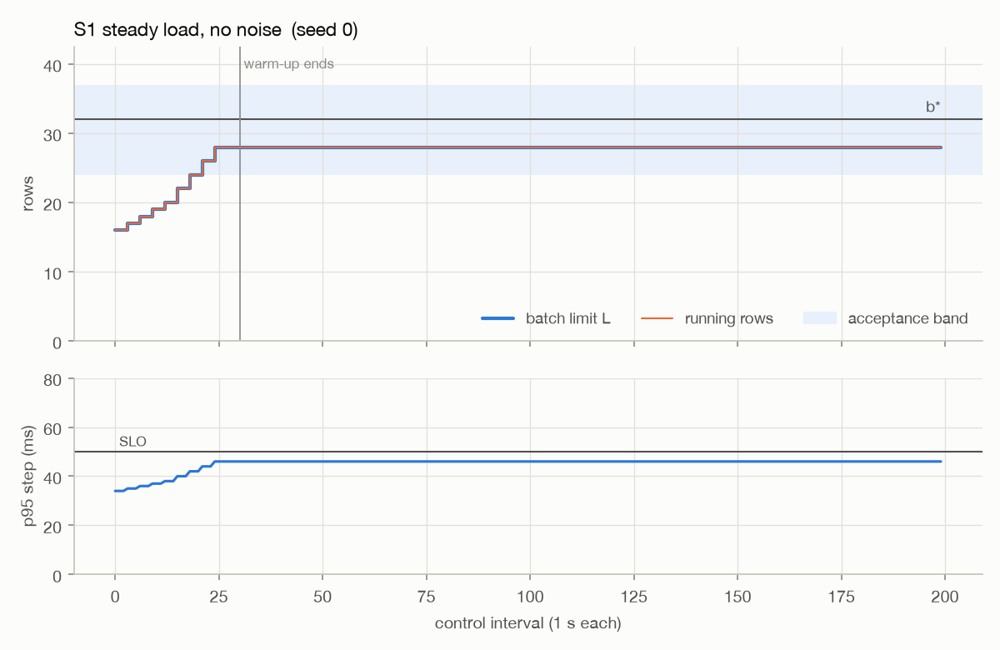
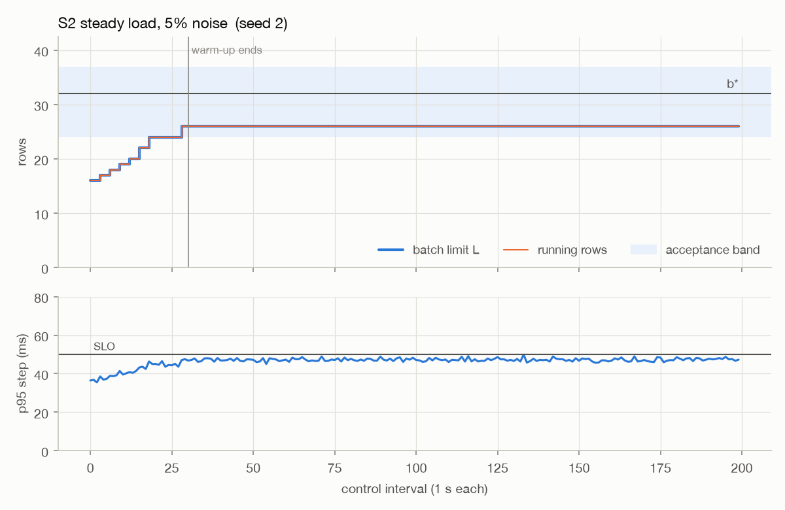
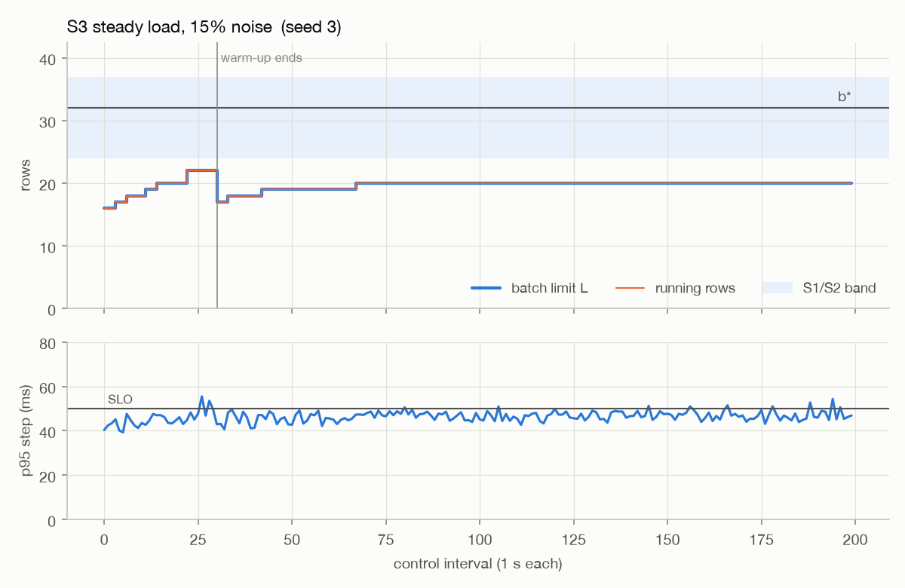
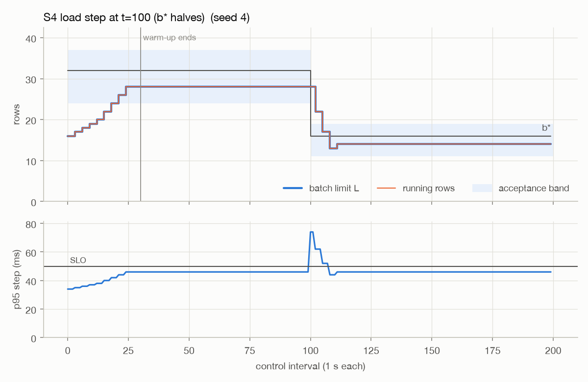
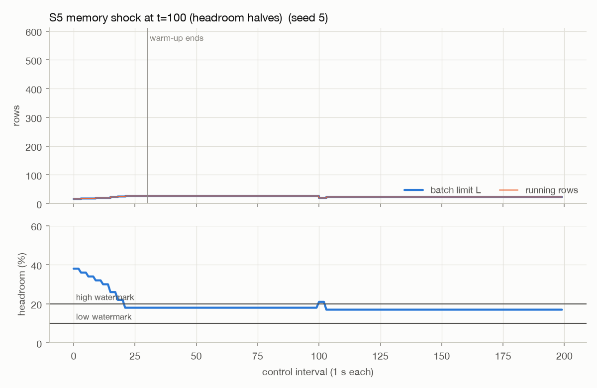

# The adaptive batch controller

The engine runs continuous batching, so the number of requests decoding together can change on
every iteration. `AIMDController` (`src/localhost_ai/engine/controller.py`) picks the ceiling on
that number, the batch limit L, once per control interval (1 s). Bigger batches mean more tokens
per second, since a decode step for 24 rows costs far less than 24 steps for one row. They also
make every step slower for everyone in the batch and use more memory. The controller keeps
growing L while decode steps stay under a per-token latency SLO and memory has headroom, and
backs off when either breaks.

## Signals

- **Decode-step time.** The wall time of each batched decode step, tagged with the batch size at
  that step and the controller epoch it ran in. Prefill time is deliberately left out. It depends
  on prompt lengths and on how many requests happened to arrive, not on batch size. An earlier
  version fed whole iterations (prefill + decode) to the controller. In review, a simulation of
  that version pinned L near 0.05 x the output length regardless of capacity.
  `test_prefill_time_does_not_drag_the_limit` guards against that regression.
- **Memory headroom.** A live reading from the device probe (see `architecture.md`), not
  windowed.
- **OOM events.** Reported by the scheduler the moment an allocation fails.

## Update rule, in priority order

1. OOM (never gated): L <- max(Lmin, floor(L/2)), applied immediately when reported, at most once
   per interval; new epoch; no increases for 3 intervals.
2. Headroom below the low watermark (10%): L <- max(Lmin, floor(0.8 L)), new epoch. Rows above
   the new L are preempted at once so memory actually drops.
3. Not enough fresh evidence (fewer than 20 decode steps, or they cover less than one interval):
   hold.
4. Fresh p95 > SLO: L <- max(Lmin, floor(0.8 L)), new epoch. Running rows drain naturally.
5. Increase cooldown active: hold.
6. Fresh p95 < 0.9 SLO, headroom above the high watermark (20%), and the batch saturated
   (queue > 0 and running >= L): L <- L + max(1, floor(L/10)), new epoch.
7. Otherwise (p95 in the [0.9 SLO, SLO] deadband): hold.
8. Clamp L to [Lmin, min(Lmax, KV ceiling)]. The KV ceiling is
   (headroom - reserve x limit + KV already held) / (kv_bytes_per_token x estimated row length).
   A clamp stops admissions but never preempts.

## Fresh evidence

Each sample carries the epoch it was measured in. Any change of L starts a new epoch and clears
the window, and SLO decisions only use samples from the current epoch that were measured while
the running batch was within the current limit. The second condition matters because after a
decrease the batch drains without preemption. Samples from those draining steps are still slow,
and counting them would recreate the problem the epochs exist to fix. Without the rule, one
overload sample in a 5 s window keeps triggering decreases after the batch has already shrunk
(the stale-window cascade: 101 -> 80 -> 64 -> 51 -> 40 in the design review's simulation).

## What it converges to

It doesn't converge to a point, and the docs shouldn't claim it does. With b* the largest batch
whose p95 decode step meets the SLO:

- With low noise, L climbs until p95 enters the deadband and then holds. In the simulator's S1
  that's 28 against b* = 32.
- When the p95 estimate is noisier than the 10% deadband, L saws between roughly 0.8x and 1x of
  a noise-adjusted boundary. The p95 of noisy steps is higher than the noise-free latency, so
  that boundary sits below b*.

## Simulator

`tests/sim_controller.py` is a discrete-time model: latency t0 + k b with multiplicative noise,
decode steps back to back, samples delivered one interval late, a closed-loop load that keeps
the queue non-empty, natural drain on SLO decreases, immediate shed on memory/OOM decisions, and
the engine's KV-ceiling formula. `tests/test_controller.py` asserts the acceptance bounds over
20 fixed seeds. `scripts/sim_report.py` writes `docs/results/sim.json`, the table below and the
figures.

<!-- sim:begin -->
Generated from `docs/results/sim.json` (20 seeds, 30-interval warm-up, b* = 32, band [24, 37]).

| scenario | plan bound | measured (worst seed) | met |
|---|---|---|---|
| S1 no noise | L in band 100% of intervals | 100% in band, L min 28 | yes |
| S2 5% noise | band >= 95%, L >= 0.64 b*, violations <= 10% | 100% in band, L min 24 (0.75 b*), violations 1% | yes |
| S3 15% noise | violations <= 20%, L >= 0.5 b* | violations 14%; L >= 0.5 b* on 19/20 seeds, worst 15 (0.469 b*) | violations yes, floor no (reported, not tuned) |
| S4 b* halves | back in new band within 6 intervals | 5 intervals | yes |
| S5 headroom halves | above low watermark within 3 intervals | 0 intervals | yes |
| S6 OOM | next interval L <= floor(L/2) | halved on every seed | yes |
| all | L <= KV ceiling, memory <= limit | peak memory 0.83 of limit | yes |

<!-- sim:end -->

## A real trace

The L(t) trace below comes from the benchmark (`bench/results/*.json`, recorded over the
telemetry WebSocket during the highest-concurrency AIMD run). See `bench/RESULTS.md` for the
full numbers.

<!-- trace:begin -->

<!-- trace:end -->
